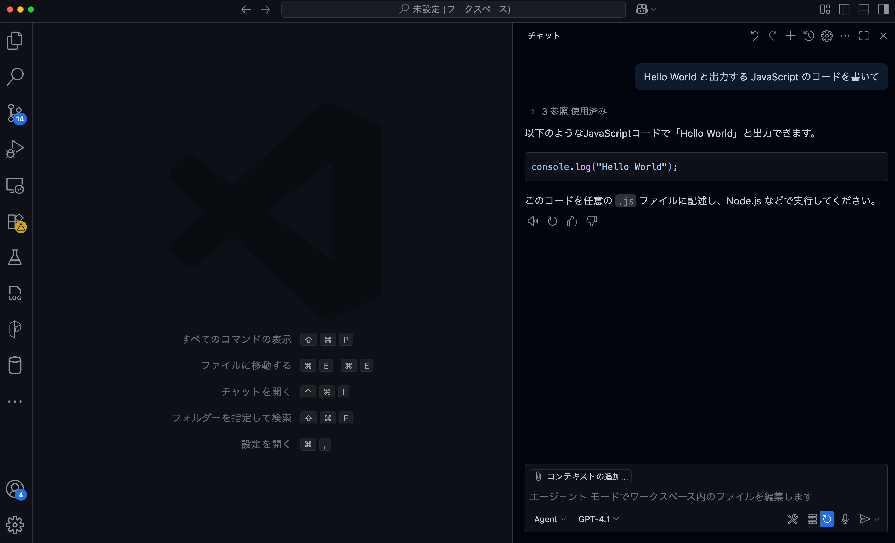

本ハンズオンでは、VS Code と GitHub Copilot の拡張機能を使用して、カスタム指示、エージェントモードなどの応用的な機能を学習します。
実際の統合ヘルプデスク・ナレッジベースシステムをベースに、新機能の設計・実装・テストという実践的な開発フローを通じて、GitHub Copilotを効果的に活用する手法を身につけます。

本ページでは、ハンズオン当日までに完了すべき環境構築手順を説明します。

## 前提条件

本ハンズオンを実施するために、以下の環境をご準備ください：

### 必要なソフトウェア

事前に以下のソフトウェアをインストールしてください：

| ソフトウェア | バージョン | 用途 | ダウンロード先 |
|------------|-----------|------|--------------|
| **Visual Studio Code** | 最新版 | 開発エディタ | [https://code.visualstudio.com/](https://code.visualstudio.com/) |
| **GitHub Copilot 拡張機能** | 最新版 | AI コーディング支援 | VS Code の拡張機能から「GitHub Copilot」を検索してインストール |
| **Git** | 2.0 以上 | バージョン管理 | [https://git-scm.com/](https://git-scm.com/) |
| **Python** | 3.11 以上 | バックエンド実行環境 | [https://www.python.org/](https://www.python.org/) |
| **Node.js** | 20.x 以上 | フロントエンド実行環境 | [https://nodejs.org/](https://nodejs.org/) |
| **npm** | 10.x 以上 | パッケージマネージャ | Node.js に同梱 |
| **Docker Desktop** | 最新版 | コンテナ実行環境 | [https://www.docker.com/products/docker-desktop](https://www.docker.com/products/docker-desktop) |

> **注意**: Mac M1/M2 をご使用の場合は、Docker の設定で `platform: linux/amd64` を有効にする必要があります（手順内で説明します）。

### バージョン確認方法

ターミナル（macOS/Linux）またはコマンドプロンプト（Windows）で以下のコマンドを実行して、各ソフトウェアが正しくインストールされているか確認してください：

```bash
# Git のバージョン確認
git --version

# Python のバージョン確認
python --version
# または
python3 --version

# Node.js のバージョン確認
node --version

# npm のバージョン確認
npm --version

# Docker のバージョン確認
docker --version
docker-compose --version
```

**期待される出力例：**
```
git version 2.39.0
Python 3.11.5
v22.21.1
10.5.0
Docker version 24.0.0, build abc1234
docker-compose version 1.29.2, build 5becea4c
```

### アプリケーション概要

本ハンズオンで使用するサンプルアプリケーションは、チケット管理とナレッジベースを統合したサポートプラットフォームです。

**主な機能：**
- **チケット管理システム**: サポートチケットの作成・追跡・管理
- **ナレッジベース**: Markdown 対応の記事作成・公開
- **ロールベースアクセス制御**: 管理者・オペレーター・利用者の3つの役割

**アーキテクチャ：**
```
┌─────────────────┐      HTTP API (Port 3000)      ┌──────────────────┐
│   Frontend      │ ────────────────────────────→ │    Backend       │
│   (Next.js)     │ ←──────────────────────────── │   (FastAPI)      │
│   Port: 3000    │      JSON Response             │   Port: 8000     │
└─────────────────┘                                └──────────────────┘
                                                            │
                                                            ↓
                                                    ┌──────────────────┐
                                                    │   SQLite DB      │
                                                    │  (helpdesk.db)   │
                                                    └──────────────────┘
```

**テストアカウント：**

| 役割 | メールアドレス | パスワード |
|-----|--------------|-----------|
| 管理者 | admin@example.com | testpass123 |
| オペレーター | operator@example.com | testpass123 |
| 利用者 | user@example.com | testpass123 |

### GitHub Copilot のセットアップ

GitHub Copilotが正常に動作するか確認しましょう：

#### 1. サインインの確認
**ステータスバーのCopilotアイコンを確認**
- VS Code画面下部のステータスバーにあるCopilotアイコンにカーソルを合わせる
- 「Set up Copilot」が表示される場合は、クリックしてセットアップを開始


#### 2. GitHubアカウントにサインイン
- 「Sign in」を選択してGitHubアカウントでサインイン
- 既にサインイン済みの場合は「Use Copilot」が表示される
- ブラウザでGitHub認証を完了させる


#### 3. サインイン状態の確認
- ステータスバーのCopilotアイコンが有効（アクティブ）状態になる
- アクティビティバーの「アカウント」メニューでGitHubアカウントが表示される

#### 4. チャットの動作確認
**Copilot Chatを開く**
- `Ctrl+Shift+I`（Windows/Linux）または `Cmd+Shift+I`（Mac）でチャットパネルを開く
- またはアクティビティバーのチャットアイコンをクリック

**動作テスト**
- チャット入力欄に「Hello World と出力するJavaScriptコードを書いて」などと入力
- Enterキーを押して送信
- Copilotからコードが返答されることを確認



---

## 動作確認

### バックエンド（Docker）

バックエンドをDockerで起動します。

#### 1. リポジトリのクローン

```bash
git clone https://github.com/marumaru1019/PoC-GitHubCopilotApp2-Backend.git
cd PoC-GitHubCopilotApp2-Backend
```

#### 2. 環境変数ファイルの作成

```bash
cp .env.example .env
```

#### 3. Docker Compose ファイルの編集（Mac M1/M2 ユーザーのみ）

Mac M1/M2 チップをご使用の場合は、`docker-compose.yml` を編集します：

```bash
# エディタで docker-compose.yml を開く
code docker-compose.yml
```

以下の行のコメントアウトを **解除** してください：

```yaml
services:
  backend:
    build:
      context: .
      dockerfile: Dockerfile
    platform: linux/amd64  # ← この行のコメントアウトを外す
```

#### 4. Docker コンテナのビルドと起動

```bash
docker-compose up --build
```

**期待される出力：**
```
Creating network "poc-githubcopilotapp2-backend_helpdesk-network" with driver "bridge"
Building backend
...
Successfully built abc123def456
Successfully tagged poc-githubcopilotapp2-backend_backend:latest
Creating helpdesk-backend ... done
Attaching to helpdesk-backend
helpdesk-backend | INFO:     Uvicorn running on http://0.0.0.0:8000 (Press CTRL+C to quit)
```

#### 5. データベースのマイグレーション実行

**新しいターミナルウィンドウを開いて**、以下のコマンドを実行：

```bash
cd PoC-GitHubCopilotApp2-Backend
docker-compose exec backend alembic upgrade head
```

#### 6. 初期データの投入

```bash
docker-compose exec backend python seed.py
```

**期待される出力：**
```
Seeding database...
Created users, teams, categories, tags, and SLA settings successfully!
```

#### 7. API ドキュメントの確認

ブラウザで以下の URL にアクセスして、Swagger UI が表示されることを確認してください：

```
http://localhost:8000/docs
```

#### 8. ログイン API のテスト

Swagger UI 上で以下の手順を実施：

1. `POST /api/auth/login` エンドポイントを展開
2. 「Try it out」ボタンをクリック
3. Request body に以下を入力：
   ```json
   {
     "email": "admin@example.com",
     "password": "testpass123"
   }
   ```
4. 「Execute」ボタンをクリック

**期待される結果：**
- **Response code**: `200`
- **Response body**: `access_token` が含まれる JSON

✅ ステータスコード 200 が返ってきたら成功です！

> **重要**: フロントエンドのセットアップで使用するため、バックエンドサーバーは **起動したまま** にしておいてください。

---

### フロントエンド

バックエンドが起動していることを確認してから、フロントエンドのセットアップを開始してください。

#### 1. リポジトリのクローン

**新しいターミナルウィンドウを開いて**、以下のコマンドを実行：

```bash
git clone https://github.com/marumaru1019/PoC-GitHubCopilotApp2-Frontend.git
cd PoC-GitHubCopilotApp2-Frontend
```

#### 2. 依存パッケージのインストール

```bash
npm install
```

**期待される出力：**
```
added 500 packages, and audited 501 packages in 30s
found 0 vulnerabilities
```

> インストールには数分かかる場合があります。

#### 3. 開発サーバーの起動

```bash
npm run dev
```

**期待される出力：**
```
▲ Next.js 15.5.6
- Local:        http://localhost:3000
- Network:      http://192.168.1.10:3000

✓ Starting...
✓ Ready in 2.5s
```

#### 4. ブラウザでアクセス

ブラウザで以下の URL にアクセス：

```
http://localhost:3000
```

ログイン画面が表示されることを確認してください。

#### 5. ログインテスト

以下の情報でログインを試してください：

- **メールアドレス**: `admin@example.com`
- **パスワード**: `testpass123`

✅ ログイン後、ダッシュボード画面が表示されたら成功です！

#### 6. 単体テストの実行

**新しいターミナルウィンドウを開いて**、以下のコマンドを実行：

```bash
cd PoC-GitHubCopilotApp2-Frontend
npm run test
```

**期待される出力例：**
```
✓ app/tickets/[id]/__tests__/page.test.tsx (2)
✓ app/tickets/new/__tests__/page.test.tsx (3)

Test Files  2 passed (2)
     Tests  5 passed (5)
```

> テストの成功・失敗に関わらず、実行できれば問題ありません。

#### 7. Playwright のインストール

E2E テストを実行するために、Playwright ブラウザをインストールします：

```bash
npx playwright install
```

**期待される出力：**
```
Downloading Chromium 123.0.6312.4 (playwright build v1234)
...
✔ Success! Playwright browsers are installed.
```

#### 8. E2E テストの実行

```bash
npm run test:e2e
```

**期待される出力例：**
```
Running 5 tests using 1 worker
  ✓  [chromium] › e2e/ticket-flow.spec.ts:3:5 › Ticket workflow › should create a new ticket (5s)
  ...

  5 passed (30s)
```

> テストの成功・失敗に関わらず、実行できれば問題ありません。

---

### ✅ 環境構築完了チェックリスト

すべてのセットアップが完了したら、以下の項目を確認してください：

- [ ] バックエンドが `http://localhost:8000` で起動している
- [ ] バックエンドの API ドキュメント (`http://localhost:8000/docs`) にアクセスできる
- [ ] ログイン API でステータスコード 200 が返ってくる
- [ ] フロントエンドが `http://localhost:3000` で起動している
- [ ] ブラウザでログイン画面が表示される
- [ ] テストアカウント (`admin@example.com` / `testpass123`) でログインできる
- [ ] 単体テスト (`npm run test`) が実行できる
- [ ] E2E テスト (`npm run test:e2e`) が実行できる

---
