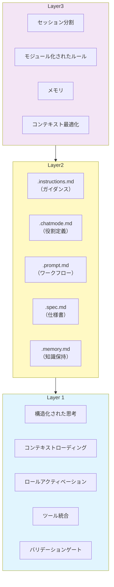

## 1. AI開発ワークフローとは？

多くの開発者は AI との対話を「プロンプトを投げて期待通りの結果を祈る」という場当たり的な方法で始めます。しかし、プロジェクトが複雑になると、この方法では以下の問題に直面します：

* 同じ質問を何度も繰り返す必要がある
* チームメンバー間で異なる結果が得られる
* 重要な文脈が失われ、不正確な回答が返される
* 一度意図した方向から逸脱すると修正が困難になる

**AI開発ワークフロー** は、これらの問題を解決するための体系的なアプローチです。3層のフレームワークにより、AI を使った開発を再現可能で信頼できるエンジニアリングプラクティスへと変革します。

> **ポイント**
>
> * **Layer 1: Markdown プロンプトエンジニアリング** … 構造化された明確なプロンプトの作成
> * **Layer 2: エージェント・プリミティブ** … 再利用可能なコンポーネントによる体系化
> * **Layer 3: コンテキストエンジニアリング** … AI が適切な情報にフォーカスできる環境設計
> * **段階的な発展** … アドホックな使い方から組織的なプラクティスへの進化

---

## 2. 3層フレームワークの構造

AI開発ワークフローは、以下の3つの層が積み重なって機能します。各層は独立して価値を提供しますが、組み合わせることで最大の効果を発揮します。



### 2.1 各層の役割

| 層 | 目的 | 効果 |
|-----|------|------|
| **Layer 1** | プロンプトの品質向上 | 予測可能で一貫性のある AI の応答 |
| **Layer 2** | 知識の体系化と再利用 | チーム全体での AI 活用の標準化 |
| **Layer 3** | AI の認知最適化 | コンテキストウィンドウの効率的な活用 |

---

## 3. Layer 1: Markdown プロンプトエンジニアリング

### :pen: 例題 - 効果的なプロンプトの構造

従来のプロンプトと構造化されたプロンプトの違いを見てみましょう。

**従来のプロンプト（非効率的）:**

```text
バグを見つけて直して
```

**構造化されたプロンプト（効果的）:**

```text
あなたは複雑なプログラミング問題のデバッグに特化したエキスパートデバッガーです。

このプロジェクトのアーキテクチャや特性は[アーキテクチャドキュメント](./docs/architecture.md)を参照してください。

以下の手順に従ってください：

1. [エラーログ](./logs/error.log)をレビューし、根本原因を特定する
2. 根本原因を見つけたら、トレードオフを考慮した3つの潜在的な解決策を考える
3. 根本原因分析と提案された解決策（トレードオフ含む）をユーザーに提示し、修正を進める前に承認を求める - ファイルを変更しないこと
```

### :robot: プロンプト構造の要素

構造化されたプロンプトには、以下の5つの重要な要素が含まれます：

```markdown
1. **ロールアクティベーション**
   "あなたは〇〇の専門家です"
   → 特定の知識ドメインを活性化

2. **コンテキストローディング**
   [リンク](./path/to/file)
   → 関連情報を注入

3. **構造化された思考**
   見出しと箇条書きで明確な推論経路を提供
   → AI の思考プロセスをガイド

4. **ツール統合**
   "〇〇ツールを使用してください"
   → 制御可能で再現可能な方法でツールを実行

5. **バリデーションゲート**
   "ユーザーの承認を得てから進めてください"
   → 重要な意思決定ポイントで人間の監督を確保
```

> 💡 **Tips**: リンクはコンテキスト注入ポイントとして機能します。ファイルパスや URL を指定することで、AI は自動的に関連情報を読み込みます。

---

## 4. Layer 2: エージェント・プリミティブ

### :pen: 例題 - エージェント・プリミティブの種類

エージェント・プリミティブは、AI エージェントに特定の機能やルールを提供する再利用可能なファイルやモジュールです。

**主要なプリミティブファイル:**

| ファイル | 用途 | 配置場所の例 |
|----------|------|-------------|
| `.instructions.md` | モジュール化されたガイダンス | `.github/instructions/` |
| `.chatmode.md` | 役割ベースの専門性とツール境界 | `.github/chatmodes/` |
| `.prompt.md` | 再利用可能なワークフロー | `.github/prompts/` |
| `.spec.md` | 実装可能な設計図 | `docs/specs/` |
| `.memory.md` | セッション間の知識保持 | `.github/memory/` |
| `.context.md` | API定義書、データモデル、アーキテクチャ図などの参照用ドキュメント | `docs/context/` |


---

## 5. Layer 3: コンテキストエンジニアリング

AI エージェントのコンテキストウィンドウ（記憶容量）は有限です。人間と同様、AI も限られた記憶の中で最も関連性の高い情報にフォーカスする必要があります。戦略的にコンテキストを管理することで、AI の信頼性と効果を大幅に向上させることができます。

### :pen: 例題 - コンテキスト最適化の実践

GitHub Copilot では、**参照機能**を使って必要な情報だけを効率的に提供できます。

**非効率的な例（コンテキスト汚染）:**

```text
なんかボタンが押せないんだけど修正して。
（AI は全ファイルから必要な情報を読み込もうとするため、無関係なコードも分析してしまう）
```

**効率的な例（コンテキスト最適化）:**

```text
#file:src/components/Button.tsx のクリックイベントが動作しない問題を修正してください。
関連するエラーは #problems で確認できます。
```

### :robot: コンテキストエンジニアリングのテクニック

| テクニック | 目的 | GitHub Copilot での実践方法 |
|-----------|------|-------------------------------|
| **コンテキスト最適化** | 必要な情報のみに焦点 | `#file`, `#problems`, `#selection` で範囲を限定 |
| **セッション分割** | 各フェーズに新鮮なコンテキスト | 計画・実装・テスト・ドキュメントで別セッション |
| **モジュール化されたルール** | 関連するルールのみ適用 | `applyTo` を使った条件付きインストラクション |
| **メモリ駆動開発** | プロジェクト知識の保持 | `.memory.md` でセッション間の知識を維持 |
| **認知フォーカス最適化** | ドメイン特化のフォーカス | `.chatmode.md` で役割ごとに専用モードを使用 |

---

## :memo: 練習

以下の練習で AI 開発ワークフローの理解を深めましょう：

1. **Layer 1: プロンプトの構造化**
   - 自分の日常的なプロンプトを1つ選び、5つの要素（ロール・コンテキスト・構造・ツール・バリデーション）を使って書き直してください
   - 元のプロンプトと構造化したプロンプトの結果を比較してください

2. **Layer 2: インストラクションファイルの作成**
   - 自分のプロジェクトに `.github/instructions/` ディレクトリを作成してください
   - よく使うプログラミング言語やフレームワーク用の `.instructions.md` ファイルを1つ作成してください
   - `applyTo` パターンを使って、特定のファイルタイプにのみ適用されるようにしてください

3. **Layer 3: コンテキスト最適化の実践**
   - プロジェクト内のバグ修正タスクを選び、以下の2つの方法を試してください：
     - 方法A: 「このバグを修正して」（参照なし）
     - 方法B: `#file:対象ファイル` と `#problems` を使って依頼
   - 2つの方法で生成されたコードの精度と速度を比較してください
   - 複数ファイルにまたがる修正の場合は、`#file` を複数指定して必要なファイルのみに焦点を当ててください

> これらの練習を通じて、AI との対話が「運任せ」から「予測可能なエンジニアリング」へと変わることを実感できます。最初は手間に感じるかもしれませんが、繰り返し使用することで大幅な時間節約と品質向上につながります。

---

## まとめ

* **3層フレームワーク** により、AI を使った開発が再現可能で信頼できるプラクティスへ変革
* **Markdown プロンプトエンジニアリング** で予測可能で一貫性のある AI の応答を実現
* **エージェント・プリミティブ** により、知識を体系化しチーム全体で再利用可能に
* **コンテキストエンジニアリング** で AI の認知能力を最適化し、効率と精度を向上
* **段階的な導入** が可能で、各層は独立して価値を提供しながら組み合わせることで最大の効果を発揮

次のセクションでは、これらの概念を実際のプロジェクトでどのように適用するかを、具体的な例を通じて学んでいきます。
