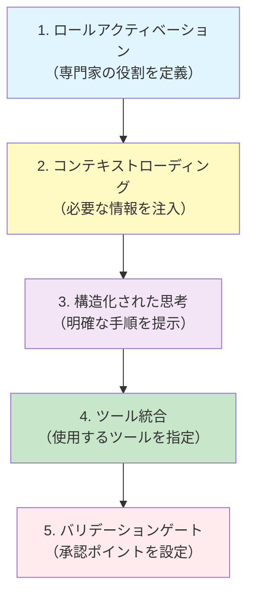

## 1. プロンプト設計とは？

プロンプト設計は、AI エージェントから一貫性のある高品質な応答を得るための技術です。単に「何をしてほしいか」を伝えるだけでなく、プロンプトを構造化することで、AI の応答をより予測可能で一貫性のあるものにできます。

ここでは、プロンプトを構造化する**1つの方法**として、5つの要素を組み合わせたアプローチを紹介します。すべての要素を常に含める必要はありませんが、タスクの複雑さや重要度に応じて適切な要素を選択することで、より効果的なプロンプトを設計できます。

---

## 2. 構造化プロンプトの設計例：5つの要素

プロンプトを構造化する1つのアプローチとして、以下の5つの要素を組み合わせる方法があります。タスクに応じて必要な要素を選択して使用してください。



### 2.1 要素別の効果

| 要素 | 目的 | 効果 |
|------|------|------|
| **ロールアクティベーション** | 特定の知識ドメインを活性化 | 専門的で焦点を絞った応答 |
| **コンテキストローディング** | 関連情報を AI に提供 | 正確で文脈に沿った提案 |
| **構造化された思考** | 明確な推論経路を提供 | 予測可能で論理的なプロセス |
| **ツール統合** | 制御可能な方法でツール実行 | 再現可能な結果 |
| **バリデーションゲート** | 人間の監督を確保 | 誤った変更の防止 |

---

## 3. 各要素の具体例と使い方

それぞれの要素がどのようにプロンプトを改善するか、具体例を見ていきましょう。必要に応じて1つまたは複数の要素を組み合わせて使用します。

### 3.1 ロールアクティベーション

#### :pen: 例題 - 専門家の役割を定義する

AI に特定の役割を割り当てることで、その分野の専門知識を活性化できます。

**基本的なプロンプト（改善前）:**

```text
コードをレビューして
```

**ロールアクティベーションを追加（改善後）:**

```text
あなたはシニアフロントエンド開発者で、React と TypeScript のベストプラクティスに精通しています。パフォーマンス最適化とアクセシビリティを特に重視してコードレビューを行ってください。

以下のコンポーネントをレビューしてください...
```

#### :robot: 効果の比較

| 指標 | 基本的なプロンプト | ロールアクティベーション付き |
|------|-------------------|--------------------------|
| **専門性** | 一般的なアドバイス | React/TS 特化の提案 |
| **フォーカス** | 広範囲 | パフォーマンスとA11y重視 |
| **一貫性** | 低い（毎回異なる視点） | 高い（常に同じ専門視点） |

> 💡 **Tips**: 役割には具体的なスキルセットや重視する観点を含めることで、より一貫性のある応答が得られます。

---

### 3.2 コンテキストローディング

#### :pen: 例題 - リンクによる情報注入

Markdown のリンク記法は、AI にとって「コンテキスト注入ポイント」として機能します。

**コンテキストなしのプロンプト:**

```text
新しい API エンドポイントを実装してください
```

**コンテキストローディングを追加:**

```text
[既存の API パターン](./src/api/patterns.ts)と[認証ガイドライン](./docs/auth.md)を参照して、ユーザー情報取得の新しい API エンドポイントを実装してください。

エンドポイント仕様:
- パス: `/api/users/:id`
- メソッド: GET
- 認証: JWT トークン必須
```

#### :robot: コンテキストローディングのパターン

```markdown
## 効果的なコンテキストローディングの書き方

### パターン1: ファイルへのリンク
[プロジェクト構造](./docs/architecture.md)を確認してください

### パターン2: 複数のリファレンス
[型定義](./types/index.ts)と[API 仕様](./docs/api-spec.md)に従ってください

### パターン3: 外部リソース
[REST API ベストプラクティス](https://restfulapi.net/)を参考にしてください

### パターン4: 既存のコード
[既存の実装](./src/components/UserProfile.tsx)と同じパターンで実装してください
```

> ⚠️ **注意**: リンクは AI が自動的に読み込むため、本当に必要な情報だけをリンクしてください。無関係な情報はコンテキストウィンドウを圧迫します。

---

### 3.3 構造化された思考

#### :pen: 例題 - 明確な手順の提示

見出しと箇条書きを使って、AI の思考プロセスをステップバイステップでガイドします。

**非構造化プロンプト:**

```text
バグを修正して、テストを追加して、ドキュメントを更新してください
```

**構造化されたプロンプト:**

```text
# バグ修正とテスト追加タスク

## フェーズ1: 問題の特定
1. [エラーログ](./logs/error.log)を分析する
2. 根本原因を特定する
3. 影響範囲を調査する

## フェーズ2: 修正の実装
1. 最小限の変更で修正を実装する
2. 既存のテストが通ることを確認する

## フェーズ3: テストの追加
1. バグを再現するテストケースを作成する
2. エッジケースもカバーする

## フェーズ4: ドキュメント更新
1. 変更内容を CHANGELOG.md に記載する
2. 関連する API ドキュメントを更新する

各フェーズ完了後、次に進む前に結果を報告してください。
```

#### :robot: 構造化のベストプラクティス

```markdown
## 効果的な構造化の要素

### ✅ 使うべき構造
- **見出し階層** で大きなステップを分ける
- **番号付きリスト** で順序を明確にする
- **チェックボックス** で完了条件を示す
- **コードブロック** で期待する形式を示す

### ❌ 避けるべき構造
- 長い段落での説明（AI が迷いやすい）
- 曖昧な表現（「適切に」「良い感じに」など）
- 複数の解釈が可能な指示
- 暗黙的な前提条件
```

---

### 3.4 ツール統合

#### :pen: 例題 - MCP ツールの明示的な指定

使用するツールを明示的に指定することで、再現可能で制御された実行が可能になります。

**ツール指定なしのプロンプト:**

```text
Azure のログを確認してエラーの原因を調べてください
```

**ツール統合を含むプロンプト:**

```text
あなたは Azure インフラストラクチャの専門家です。

## 調査手順

1. **ローカルログの確認**
   [エラーログ](./logs/error.log)で初期症状を確認する

2. **Azure ログの取得**
   `azmcp-monitor-log-query` MCP ツールを使用して、過去1時間の Application Insights ログを取得する
   
   クエリパラメータ:
   - timeRange: "PT1H"
   - query: "traces | where severityLevel >= 3"

3. **相関分析**
   ローカルログと Azure ログのタイムスタンプを照合し、根本原因を特定する

4. **報告**
   発見した問題と推奨される解決策をまとめる
```

#### :robot: ツール統合のパターン

| シナリオ | 使用するツール | プロンプト例 |
|---------|---------------|-------------|
| **コードベース検索** | `#codebase` | `#codebase で認証関連のコードを検索してください` |
| **Web情報取得** | `#fetch` | `#fetch で https://example.com の内容を取得してください` |
| **ファイル検索** | `file-search` | `file-search ツールで **/*.test.ts パターンのファイルを探してください` |
| **ターミナル実行** | `runCommands` | `runCommands ツールで npm test を実行してください` |

> 💡 **Tips**: VS Code の GitHub Copilot は、チャットモードの `tools` フィールドで利用可能なツールを制限できます。これにより、意図しないツールの使用を防げます。

---

### 3.5 バリデーションゲート

#### :pen: 例題 - 承認ポイントの設定

重要な意思決定ポイントで人間の承認を求めることで、誤った変更を防ぎます。

**バリデーションゲートなしのプロンプト:**

```text
データベーススキーマを変更してマイグレーションを実行してください
```

**バリデーションゲート付きプロンプト:**

```text
# データベーススキーマ変更タスク

## フェーズ1: 現状分析
1. [現在のスキーマ](./prisma/schema.prisma)を確認する
2. 変更による影響範囲を特定する
3. 既存データとの互換性を確認する

## ⚠️ バリデーションゲート #1
**ここで停止してください**

以下を報告し、ユーザーの承認を得てから続行してください：
- 変更内容の詳細
- 影響を受けるテーブルとカラム
- データ移行が必要かどうか
- ロールバック戦略

## フェーズ2: マイグレーション作成（承認後のみ）
1. マイグレーションファイルを生成する
2. マイグレーションの内容をレビュー用に表示する

## ⚠️ バリデーションゲート #2
**ここで停止してください**

マイグレーションの内容を確認し、承認を得てから実行してください。

## フェーズ3: 実行（承認後のみ）
1. バックアップの確認を促す
2. マイグレーションを実行する
3. 結果を報告する
```

---

## 4. 実践例：5つの要素を組み合わせた構造化プロンプト

### :pen: 例題 - タスク管理CLIツールの作成

タスクの複雑さに応じて、5つの要素を組み合わせた高度に構造化されたプロンプトを設計できます。以下は、複雑なタスクに対して全要素を活用した例です。この例は、他のファイルなしで完全に試せる自己完結型の内容です。

#### ステップ1: まず、コンテキスト用のドキュメントを作成

実際に Copilot に以下のプロンプトを渡して、参照用ドキュメントを作成します：

```text
以下の内容で coding_standards.md というドキュメントを作成してください：

# コーディング規約

## Python スタイルガイド
- PEP 8 に準拠する
- 関数には必ず docstring を記載する
- 型ヒントを使用する（Python 3.9+）

## エラーハンドリング
- 予期されるエラーは適切に catch する
- エラーメッセージはユーザーフレンドリーに
- ログ出力には logging モジュールを使用

## CLI 設計
- argparse を使用してコマンドライン引数を処理
- --help オプションで使い方を表示
- サブコマンド形式を採用（add, list, done など）
```

#### ステップ2: コンテキストを参照する完全なプロンプト

ドキュメントを作成したら、以下のプロンプトを使用します：

**改善前（基本的なプロンプト）:**
```text
Todoを管理するPythonスクリプトを書いて
```

**改善後（5つの要素を組み合わせたプロンプト）:**
````markdown
以下の内容で タスク管理CLIツールを実装してください：

# シンプルなタスク管理CLIツールの実装

## ロール定義
あなたは Python CLI アプリケーション開発の専門家です。
ユーザビリティとコードの保守性を重視し、
業界標準のベストプラクティスに従った実装を行います。

## コンテキストローディング
[コーディング規約](./coding_standards.md)に従って実装してください。
特に以下の点を重視してください：
- 型ヒントの使用
- 適切な docstring
- argparse によるCLI設計

## 実装手順

### ステップ1: 基本構造の作成
1. タスクを保存する JSON ファイル (tasks.json) を管理する
2. タスクの構造を定義する（id, title, done, created_at）
3. ファイル読み書きの基本関数を実装する

### ステップ2: CLI コマンドの実装
以下のサブコマンドを実装してください：
1. `add <タスク名>` - 新しいタスクを追加
2. `list` - すべてのタスクを一覧表示
3. `done <タスクID>` - タスクを完了にする
4. `delete <タスクID>` - タスクを削除

**🚨 バリデーションゲート**
ここで一度停止してください。
基本機能の実装方針とデータ構造を提示し、確認を求めてください。
追加したい機能（priority、due_date など）があれば教えてください。

### ステップ3: 機能拡張（承認後）
1. タスクの表示を見やすくフォーマット（完了/未完了の区別など）
2. エラーハンドリングを追加（存在しないID、ファイル破損など）
3. --help オプションで使い方を表示

## 実装要件
- [ ] Python 3.9 以上で動作
- [ ] 型ヒント付きの関数定義
- [ ] 各関数に docstring
- [ ] argparse によるCLI実装
- [ ] JSON ファイルでデータ永続化
- [ ] エラーハンドリング
- [ ] 使用例を含む README

## 期待する出力
- todo.py（メインスクリプト）
- tasks.json（データファイル、初回実行時に自動生成）
- README.md（使い方の説明）

## 実行例
```
python todo.py add "プロンプト設計の資料を読む"
python todo.py list
python todo.py done 1
```
````

### :robot: 5つの要素がどのように機能するか

```markdown
【① ロールアクティベーション】
「Python CLI アプリケーション開発の専門家」
→ argparse の使用、標準的なCLI設計パターン

【② コンテキストローディング】
[コーディング規約](./coding_standards.md) を参照
→ 型ヒント、docstring、エラーハンドリングが自動適用

【③ 構造化された思考】
ステップ1→2→3の明確な実装順序
→ データ層→コマンド実装→拡張機能の段階的開発

【④ ツール統合】
argparse, JSON, typing の明示的な指定
→ 適切なライブラリ選択と一貫した実装

【⑤ バリデーションゲート】
基本機能実装後に承認を求める
→ 機能拡張前にデータ構造と方針を確認可能
```

### :robot: 実際に試してみよう

**手順:**

1. **新しいフォルダを作成**
   ```bash
   mkdir todo-cli-demo
   cd todo-cli-demo
   ```

2. **VS Code で Copilot Chat を開く**
   - まず「ステップ1のプロンプト」で `coding_standards.md` を作成
   - 次に「ステップ2のプロンプト」でメインスクリプトを作成

3. **生成されたコードの例**

```python
# todo.py
"""
シンプルなタスク管理CLIツール

Usage:
    python todo.py add "タスク名"
    python todo.py list
    python todo.py done <id>
    python todo.py delete <id>
"""

import argparse
import json
from datetime import datetime
from pathlib import Path
from typing import List, Dict, Optional

TASKS_FILE = Path("tasks.json")

def load_tasks() -> List[Dict]:
    """タスク一覧をJSONファイルから読み込む
    
    Returns:
        List[Dict]: タスクのリスト
    """
    if not TASKS_FILE.exists():
        return []
    
    try:
        with open(TASKS_FILE, "r", encoding="utf-8") as f:
            return json.load(f)
    except json.JSONDecodeError:
        print("⚠️  タスクファイルが破損しています。新しいファイルを作成します。")
        return []

def save_tasks(tasks: List[Dict]) -> None:
    """タスク一覧をJSONファイルに保存する
    
    Args:
        tasks: 保存するタスクのリスト
    """
    with open(TASKS_FILE, "w", encoding="utf-8") as f:
        json.dump(tasks, f, ensure_ascii=False, indent=2)

# ... 以下、add_task, list_tasks, done_task などの実装
```

4. **動作確認**
   ```bash
   python todo.py add "GitHub Copilot を使ってみる"
   python todo.py list
   ```

> 💡 **実践のコツ**: 
> - バリデーションゲートで停止させ、「priority フィールドを追加したい」などの追加要求を出してみてください
> - `coding_standards.md` の内容を変更して、コーディングスタイルがどう変わるか試してみてください
> - コンテキストファイルがある場合とない場合で、生成されるコードの品質を比較してみてください

---

## :memo: 練習

以下の練習でプロンプトの構造化手法を習得しましょう：

1. **構造化要素の段階的適用**
   - 自分がよく使うプロンプトを1つ選んでください
   - 5つの要素（ロール・コンテキスト・構造・ツール・バリデーション）の中から、タスクに適した要素を1〜2つ選んで追加してください
   - 構造化前と構造化後で結果を比較してください
   - さらに別の要素を追加すると、どのような改善が見られるか試してください

2. **コンテキストローディングの実践**
   - 自分のプロジェクトで、AI に参照してほしいドキュメントやコードファイルを3つ選んでください
   - それらを Markdown リンク形式でプロンプトに含めてください
   - リンクありとなしで AI の応答の精度を比較してください

3. **バリデーションゲートの設計**
   - データベース変更やデプロイなど、リスクの高いタスクを1つ選んでください
   - 適切な承認ポイントを特定してください
   - 各承認ポイントで確認すべき内容をリスト化してください
   - そのタスク用の完全なプロンプトを作成してください

> プロンプト設計は「アート」ではなく「エンジニアリング」です。これらの要素を体系的に適用することで、誰でも高品質なプロンプトを作成できます。最初は時間がかかりますが、パターンを学ぶことで効率的になります。

---

## まとめ

* **プロンプトの構造化** により、AI からの応答が予測可能で一貫性のあるものに
* **5つの要素** は構造化の1つのアプローチ。タスクに応じて必要な要素を選択
* **ロールアクティベーション** で専門知識ドメインを活性化し、フォーカスした応答を獲得
* **コンテキストローディング** により、関連情報を効率的に AI に提供
* **構造化された思考** で明確な推論経路を提供し、AI の思考プロセスをガイド
* **ツール統合** により、再現可能で制御された方法でツールを実行
* **バリデーションゲート** で重要な意思決定ポイントに人間の監督を確保
* 単純なタスクには1〜2要素、複雑なタスクには複数要素を組み合わせるのが効果的

次のセクションでは、これらのプロンプト設計の知識を「再利用可能なコンポーネント」として体系化する方法を学びます。
