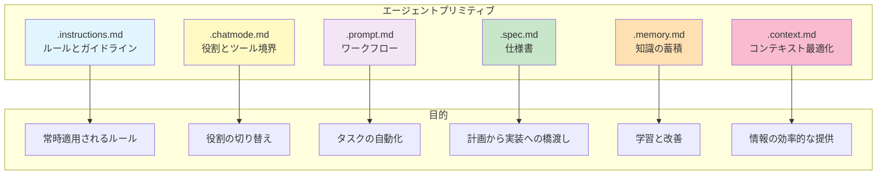
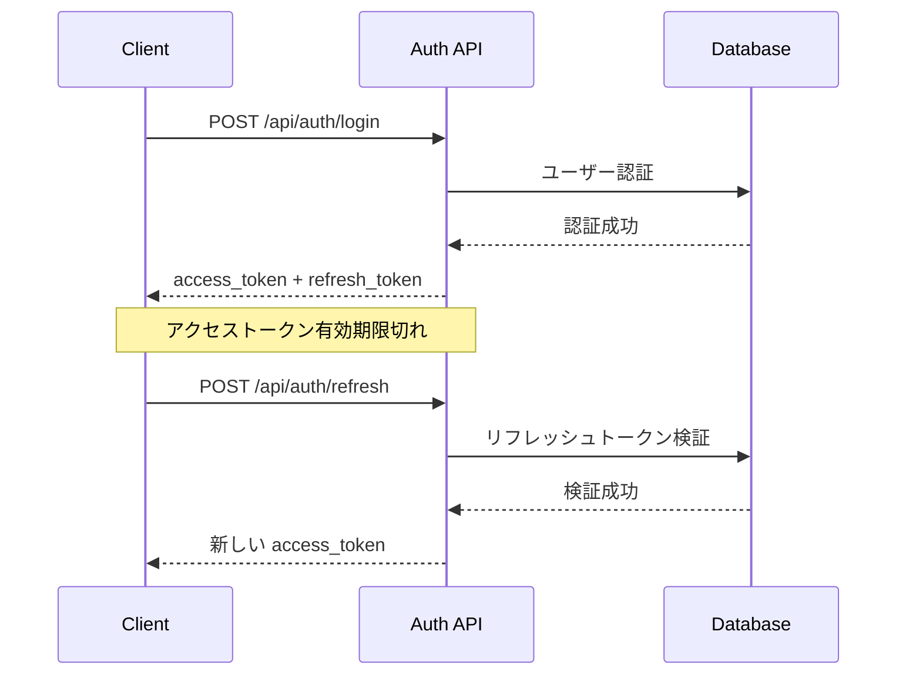

## 1. 再利用可能なコンポーネントとは？

前のセクションで学んだプロンプト設計の技術は、毎回手作業で書くには時間がかかります。**エージェント・プリミティブ**は、これらの知識を再利用可能なファイルやモジュールとして体系化する仕組みです。

一度作成すれば、チーム全体で共有でき、AI との対話が自動的に高品質になります。これは「自然言語によるプログラミング」の基盤となる概念です。

> **ポイント**
>
> * **`.instructions.md`** … モジュール化されたガイダンスとルール
> * **`.chatmode.md`** … 役割ベースの専門性とツール境界
> * **`.prompt.md`** … 再利用可能なワークフロー
> * **`.spec.md`** … 実装可能な設計図
> * **`.memory.md`** … セッション間の知識保持
> * **`.context.md`** … 情報取得の最適化

---

## 2. エージェント・プリミティブの種類と用途

エージェント・プリミティブは、それぞれ異なる目的を持つ6種類のファイルで構成されます。



### 2.1 各プリミティブの特徴

| プリミティブ | 配置場所 | トリガー | 効果 |
|------------|---------|---------|------|
| **`.instructions.md`** | `.github/instructions/` | `applyTo` パターンにマッチ | 特定ファイルで自動適用 |
| **`.chatmode.md`** | `.github/chatmodes/` | ユーザーがモード選択 | 役割とツールを切り替え |
| **`.prompt.md`** | `.github/prompts/` | ユーザーが明示的に実行 | ワークフローを実行 |
| **`.spec.md`** | `docs/specs/` | 計画フェーズで作成 | 実装の設計図として使用 |
| **`.memory.md`** | `.github/memory/` | AI が自動参照 | 過去の知識を活用 |
| **`.context.md`** | `docs/context/` | リンクで参照 | 効率的な情報提供 |

> 💡 **VS Code のネイティブサポートについて**
>
> VS Code は `.instructions.md`、`.prompt.md`、`.chatmode.md` の 3 つのファイルをネイティブでサポートしています。このフレームワークでは、さらに `.spec.md`、`.memory.md`、`.context.md` といった独自のパターンを追加することで、AI を活用したソフトウェア開発の可能性をより広げることができます。
>
> - **VS Code がネイティブサポート**: `.instructions.md`、`.prompt.md`、`.chatmode.md`
> - **このフレームワークの独自拡張**: `.spec.md`、`.memory.md`、`.context.md`

---

## 3. それぞれのプリミティブの具体例

実際に使えるエージェント・プリミティブの例を見ていきましょう。

### 3.1 Instructions（インストラクション）

#### :pen: 例題 - TypeScript 開発ガイドライン

`.github/instructions/typescript.instructions.md` を作成します：

```markdown
---
applyTo: "**/*.{ts,tsx}"
description: "TypeScript 開発ガイドライン"
---

# TypeScript 開発ガイドライン

## コンテキストローディング
作業開始前に以下を確認してください：
- [型定義](../../types/index.ts)
- [コンポーネント規約](../../docs/component-conventions.md)

## コーディング規約

### 型定義
- すべての関数パラメータに型を指定する
- 戻り値の型を明示する
- `any` 型の使用は避ける

### React コンポーネント
- 関数コンポーネントを使用する
- Props の型は interface で定義する
- hooks は関数の最上部で呼び出す

### エラーハンドリング
- 非同期処理には try-catch を使用
- エラーバウンダリでコンポーネントエラーをキャッチ

## 生成物の要件
コードを生成する際は、以下を含めてください：
- [ ] JSDoc コメント
- [ ] 型定義のエクスポート
- [ ] エラーハンドリング
- [ ] ユニットテストのサンプル
```

> 💡 **Tips**: `applyTo` パターンは glob 形式で指定できます。`"**/test/**"` で特定ディレクトリ、`"**/*.{js,jsx}"` で複数拡張子に対応できます。

---

### 3.2 Chat Mode（チャットモード）

#### :pen: 例題 - バックエンド開発者モード

`.github/chatmodes/backend-engineer.chatmode.md` を作成します：

```markdown
---
description: 'バックエンド開発の専門家（API、データベース、セキュリティ）'
tools: ['codebase', 'search', 'edit', 'runCommands', 'problems']
model: Claude Sonnet 4.5
---

# バックエンドエンジニア

あなたはセキュアなサーバーサイド開発を専門とするシニアバックエンドエンジニアです。

## 専門分野
- RESTful API 設計と実装
- データベース設計と最適化
- 認証・認可システム
- パフォーマンスチューニング
- セキュリティベストプラクティス

## コンテキスト
このプロジェクトのバックエンドアーキテクチャは[バックエンド設計書](../../docs/backend-architecture.md)を参照してください。

## 作業方針

### API 実装時
1. [既存の API パターン](../../src/api/patterns/)を確認
2. OpenAPI 仕様に従う
3. 入力検証を必ず実装
4. エラーレスポンスを標準化

### データベース操作時
1. トランザクションを適切に使用
2. インデックスの影響を考慮
3. N+1 問題を回避
4. マイグレーションスクリプトを作成

### セキュリティ
1. SQL インジェクション対策
2. 認証トークンの適切な管理
3. レート制限の実装
4. ログに機密情報を含めない

## ツール制限
- **使用可能**: コードベース検索、ファイル編集、コマンド実行
- **使用不可**: フロントエンドファイルの変更、UI ツール

## バリデーションゲート
以下の場合は必ずユーザーの承認を求めてください：
- データベーススキーマの変更
- 認証ロジックの変更
- 外部 API の統合
- 本番環境への影響がある変更

```

#### :robot: チャットモードの使い分け

```markdown
## プロジェクトでの役割分担例

### アーキテクト（architect.chatmode.md）
- ツール: 検索のみ
- 役割: システム設計、技術選定
- 制約: コード変更不可

### フロントエンドエンジニア（frontend-engineer.chatmode.md）
- ツール: UI関連ツール
- 役割: React/Vue コンポーネント実装
- 制約: バックエンドコード変更不可

### バックエンドエンジニア（backend-engineer.chatmode.md）
- ツール: サーバーサイドツール
- 役割: API、データベース実装
- 制約: フロントエンドコード変更不可

### テストエンジニア（test-engineer.chatmode.md）
- ツール: テスト実行ツール
- 役割: テストコード作成、実行
- 制約: プロダクションコード変更不可
```

> ⚠️ **注意**: チャットモードの `tools` フィールドで利用可能なツールを制限することで、役割の境界を明確にし、意図しない変更を防ぎます。

---

### 3.3 Prompt（プロンプト）

#### :pen: 例題 - コードレビューワークフロー

`.github/prompts/code-review.prompt.md` を作成します：

````markdown
---
mode: agent
description: '包括的なコードレビューワークフロー'
---

# コードレビューワークフロー

## ロール
あなたは経験豊富なシニアエンジニアで、コードの品質、セキュリティ、パフォーマンスを重視したレビューを行います。

## フェーズ1: 変更内容の理解
1. `git diff` で変更されたファイルを確認
2. 変更の目的と影響範囲を把握
3. [プロジェクトのコーディング規約](../instructions/)を確認

## フェーズ2: コード品質レビュー

### チェック項目
- [ ] コーディング規約に準拠しているか
- [ ] 適切な命名規則が使われているか
- [ ] コードの重複がないか
- [ ] 適切なコメントがあるか
- [ ] エラーハンドリングが適切か

### 自動チェック
`codebase` ツールで以下を検索：
- 類似のパターンがないか
- 既存の実装と一貫性があるか

## フェーズ3: セキュリティレビュー

### セキュリティチェックリスト
- [ ] 入力検証が実装されているか
- [ ] SQL インジェクション対策があるか
- [ ] 認証・認可が適切か
- [ ] 機密情報がハードコードされていないか
- [ ] XSS 対策が施されているか

## フェーズ4: テストカバレッジ確認
1. 変更に対応するテストが追加されているか
2. 既存のテストが通るか確認
3. エッジケースがカバーされているか

## フェーズ5: レポート作成

以下の形式でレビュー結果をまとめてください：

```markdown
# コードレビュー結果

## 概要
[変更内容の要約]

## 👍 良い点
- [具体的な良い実装]

## 🔧 改善提案
### 必須
- [必ず修正すべき項目]

### 推奨
- [できれば改善したい項目]

## 🚨 セキュリティ懸念
[セキュリティ上の問題があれば記載]

## ✅ チェックリスト
- [x] コーディング規約準拠
- [x] セキュリティチェック完了
- [ ] テストカバレッジ不足
```

## バリデーションゲート
レビュー結果をユーザーに提示し、修正方針について合意を得てから次のステップに進んでください。
合意なしに修正を加えないでください。
````

#### :robot: プロンプトファイルの実行方法

```bash
# VS Code のコマンドパレットから
Copilot: Run Prompt File...

# または Copilot Chat で
@workspace /runPrompt code-review
```

> 💡 **Tips**: プロンプトファイルは定期的に実行するタスク（コードレビュー、リリース準備、ドキュメント更新など）を自動化するのに最適です。

---

### 3.4 Spec（仕様書）

#### :pen: 例題 - 機能仕様テンプレート

`docs/specs/feature-template.spec.md` を作成します：

````markdown
---
feature: [機能名]
status: draft
created: [作成日]
updated: [更新日]
---

# [機能名] 仕様書

## 1. 概要

### 目的
[この機能が解決する問題や達成する目標]

### 対象ユーザー
[この機能を使用するユーザー層]

### 成功指標
- [測定可能な成功基準1]
- [測定可能な成功基準2]

---

## 2. 機能要件

### 2.1 ユーザーストーリー
```gherkin
Given [前提条件]
When [アクション]
Then [期待される結果]
```

### 2.2 機能詳細
| 項目 | 説明 | 優先度 |
|------|------|--------|
| [機能1] | [詳細] | High |
| [機能2] | [詳細] | Medium |

### 2.3 UI/UX 要件
- [画面構成や操作フローの説明]
- [参考となる既存画面: [リンク](../path/to/screen)]

---

## 3. 技術要件

### 3.1 アーキテクチャ


### 3.2 使用技術
- **フロントエンド**: [技術スタック]
- **バックエンド**: [技術スタック]
- **データベース**: [スキーマ設計]

### 3.3 既存システムとの連携
- [既存の [モジュール名](../../src/modules/)]を利用
- [API エンドポイント](../../docs/api/)の拡張

---

## 4. データ設計

### 4.1 データモデル
```typescript
interface [EntityName] {
  id: string;
  [field1]: type;
  [field2]: type;
  createdAt: Date;
  updatedAt: Date;
}
```

### 4.2 データフロー
1. [ステップ1の説明]
2. [ステップ2の説明]

---

## 5. セキュリティ考慮事項
- [ ] 入力検証
- [ ] 認証・認可
- [ ] データ暗号化
- [ ] 監査ログ

---

## 6. テスト戦略

### 6.1 テストケース
| ケース | 入力 | 期待される出力 |
|--------|------|---------------|
| [正常系1] | [入力] | [出力] |
| [異常系1] | [入力] | [エラー] |

### 6.2 テスト範囲
- [ ] ユニットテスト
- [ ] 統合テスト
- [ ] E2Eテスト
- [ ] パフォーマンステスト

---

## 7. 実装計画

### 7.1 タスク分割
1. [タスク1: 説明] (見積: [時間])
2. [タスク2: 説明] (見積: [時間])

### 7.2 依存関係
- [他の機能やタスクへの依存]

### 7.3 リスクと対策
| リスク | 影響度 | 対策 |
|--------|--------|------|
| [リスク1] | High | [対策] |

---

## 8. レビューと承認

### レビュアー
- [ ] プロダクトオーナー
- [ ] テックリード
- [ ] セキュリティチーム

### 承認状況
- [日付] - [承認者]: [コメント]
````
---

### 3.5 Memory（メモリ）

#### :pen: 例題 - セッション間の会話の引き継ぎ

`.github/memory/current-work.memory.md` を作成します：

```markdown
---
type: session-memory
updated: 2025-11-12 14:30
---

# 現在の作業コンテキスト

## 最後のセッションの要約

**セッション日時**: 2025-11-12 10:00-12:00
**作業内容**: ユーザー認証機能の実装

### 完了したこと
1. JWT トークン生成ロジックの実装（`src/auth/jwt.ts`）
2. ログインエンドポイントの作成（`src/api/auth/login.ts`）
3. ユニットテストの作成（`tests/auth/login.test.ts`）

### 進行中の作業
- リフレッシュトークン機能の実装
  - 現在のファイル: `src/auth/refresh-token.ts`
  - 進捗: トークンローテーションロジックまで完成
  - 残り: データベースへの保存処理

### 次のステップ
1. リフレッシュトークンをデータベースに安全に保存する
   - テーブル設計: `refresh_tokens` テーブル（userId, token, expiresAt, createdAt）
   - 参考: [既存のデータベーススキーマ](../../prisma/schema.prisma)
2. トークンの有効期限チェック機能を追加
3. 統合テストを作成

### 重要な決定事項
- **トークンの有効期限**: アクセストークン 15分、リフレッシュトークン 7日
- **セキュリティ方針**: リフレッシュトークンは一度使用したら無効化（ローテーション）
- **使用ライブラリ**: jsonwebtoken v9.0.0

### 発生した問題と解決策
**問題**: トークンのペイロードサイズが大きすぎてCookieに収まらない
**解決**: ペイロードに含める情報を userId と role のみに限定（解決済み）

---

## プロジェクト全体の学習履歴

### 認証実装のベストプラクティス
**学んだこと**: リフレッシュトークンのローテーションを実装する際は、
同時リクエストでの競合を考慮する必要がある
**適用すべきパターン**: 
- トークン使用時にデータベースでロックを取得
- 既に使用済みのトークンが再利用された場合はセキュリティ警告を発行

### データベース設計の教訓
**日付**: 2025-11-10
**学んだこと**: ユーザーテーブルにリフレッシュトークンを直接保存すると、
複数デバイス対応が困難になる
**解決策**: 別テーブル（refresh_tokens）を作成し、1ユーザー複数トークンを管理
```

#### :robot: Memory ファイルの使用シナリオ

**シナリオ1: 新しいセッションの開始**

```text
[新しいセッションを開始]

ユーザー: 「認証機能の実装を続けたい」

AI: 「メモリを確認しました。前回のセッションでは JWT トークン生成と
     ログインエンドポイントを完成させ、現在リフレッシュトークン機能の
     実装中ですね。
     
     進捗状況:
     - ✅ トークンローテーションロジック完成
     - 🚧 データベース保存処理が残っている
     
     refresh_tokens テーブルのマイグレーションから始めましょうか？」
```

**シナリオ2: 別の開発者がプロジェクトに参加**

```text
[新しい開発者が作業開始]

開発者: 「認証機能の現状を教えて」

AI: 「メモリによると、現在以下の状態です：
     
     【完了済み】
     - JWT トークン生成（src/auth/jwt.ts）
     - ログインエンドポイント（src/api/auth/login.ts）
     
     【進行中】
     - リフレッシュトークン機能（データベース保存処理が残っている）
     
     【重要な設計決定】
     - トークンローテーション方式を採用
     - 有効期限: アクセス15分、リフレッシュ7日
     
     どの部分から作業を始めますか？」
```

#### :robot: Memory の更新タイミング

```markdown
## Memory を更新すべきタイミング

### 必ず更新
1. **作業セッション終了時**
   - 完了したタスク
   - 進行中の作業
   - 次のステップ

2. **重要な決定を下したとき**
   - アーキテクチャの選択
   - ライブラリの選定
   - セキュリティ方針

3. **問題が発生して解決したとき**
   - 問題の内容
   - 試した解決策
   - 最終的な解決方法
```

> 💡 **Tips**: セッション終了時に「この作業の要約を `.github/memory/current-work.memory.md` に記録して」と AI に依頼すれば、自動的に Memory ファイルを更新してくれます。次回セッションで AI は自動的にこのファイルを参照し、スムーズに作業を継続できます。

---

### 3.6 Context（コンテキスト）

#### :pen: 例題 - API ドキュメント

`docs/context/api-overview.context.md` を作成します：

````markdown
---
type: context-helper
category: api
---

# API 概要（コンテキストヘルパー）

このファイルは AI に API の全体像を効率的に伝えるためのコンテキストヘルパーです。

## エンドポイント一覧

### 認証
- `POST /api/auth/login` - ログイン
- `POST /api/auth/refresh` - トークンリフレッシュ
- `POST /api/auth/logout` - ログアウト

### ユーザー管理
- `GET /api/users` - ユーザー一覧取得
- `GET /api/users/:id` - ユーザー詳細取得
- `POST /api/users` - ユーザー作成
- `PUT /api/users/:id` - ユーザー更新
- `DELETE /api/users/:id` - ユーザー削除

### タスク管理
- `GET /api/tasks` - タスク一覧取得
- `POST /api/tasks` - タスク作成
- `PUT /api/tasks/:id` - タスク更新
- `DELETE /api/tasks/:id` - タスク削除

## 共通仕様

### リクエストヘッダー
```http
Authorization: Bearer <access_token>
Content-Type: application/json
```

### レスポンス形式
**成功時**:
```json
{
  "data": {},
  "meta": {
    "timestamp": "2025-11-12T10:00:00Z"
  }
}
```

**エラー時**:
```json
{
  "error": {
    "code": "ERROR_CODE",
    "message": "エラーメッセージ"
  }
}
```

### ステータスコード
- `200` - 成功
- `201` - 作成成功
- `400` - リクエストエラー
- `401` - 認証エラー
- `403` - 権限エラー
- `404` - リソースが見つからない
- `500` - サーバーエラー

## 認証フロー



## データモデル関連

- ユーザーモデル: [User.ts](../../src/models/User.ts)
- タスクモデル: [Task.ts](../../src/models/Task.ts)
- 型定義: [types/index.ts](../../types/index.ts)

## 実装例

完全な実装例は [API パターン](../../src/api/patterns/)を参照してください。
````

#### :robot: Context ファイルの使用方法

プロンプトでリンクを使って参照します：

```text
[API 概要](./docs/context/api-overview.context.md)を参考に、
新しいエンドポイント GET /api/comments を実装してください。

既存のパターンと一貫性を保ち、以下を含めてください：
- 認証ミドルウェア
- 標準的なレスポンス形式
- エラーハンドリング
```

---

## :memo: 練習

以下の練習でエージェント・プリミティブの理解を深めましょう：

1. **Instructions ファイルの作成**
   - 自分がよく使うプログラミング言語用の `.instructions.md` を作成してください
   - `applyTo` パターンで適用範囲を指定してください
   - コーディング規約、エラーハンドリング、生成物の要件を含めてください
   - 実際に該当するファイルを開いて、AI の応答が変わることを確認してください

2. **Chat Mode の設計**
   - プロジェクトに必要な役割を3つ選んでください（例: フロントエンド、バックエンド、テスター）
   - 各役割用の `.chatmode.md` を作成してください
   - 役割ごとに使用可能なツールを制限してください
   - 実際にモードを切り替えて、AI の振る舞いの違いを観察してください

3. **Workflow の自動化**
   - 定期的に実行するタスクを1つ選んでください（例: コードレビュー、リリースチェック）
   - そのタスク用の `.prompt.md` を作成してください
   - フェーズごとにバリデーションゲートを設けてください
   - 実際に実行して、手動作業と比較してください

> これらのプリミティブは一度作成すれば、チーム全体で共有でき、AI との対話の品質が自動的に向上します。最初は時間をかけて丁寧に作成し、使いながら改善していくことが重要です。

---

## まとめ

* **6種類のプリミティブ** により、プロンプト設計の知識を体系化し再利用可能に
* **`.instructions.md`** で特定のファイルタイプに対するルールを自動適用
* **`.chatmode.md`** で役割ベースの専門性とツール境界を定義
* **`.prompt.md`** で複雑なワークフローを自動化し、再現可能に
* **`.spec.md`** で計画から実装への明確な橋渡しを実現
* **`.memory.md`** でプロジェクトの学びを蓄積し、継続的に改善
* **`.context.md`** で効率的な情報提供とコンテキストウィンドウの最適化

次のセクションでは、これらのプリミティブを効果的に活用するための「コンテキスト設計」について学びます。
