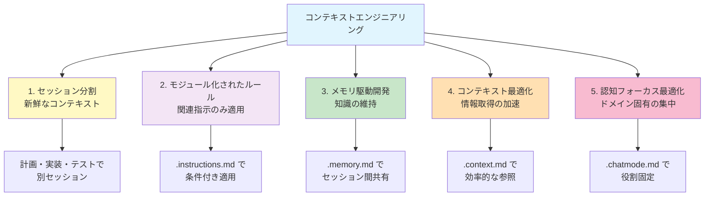
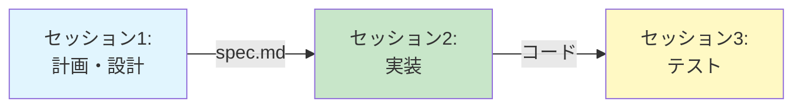
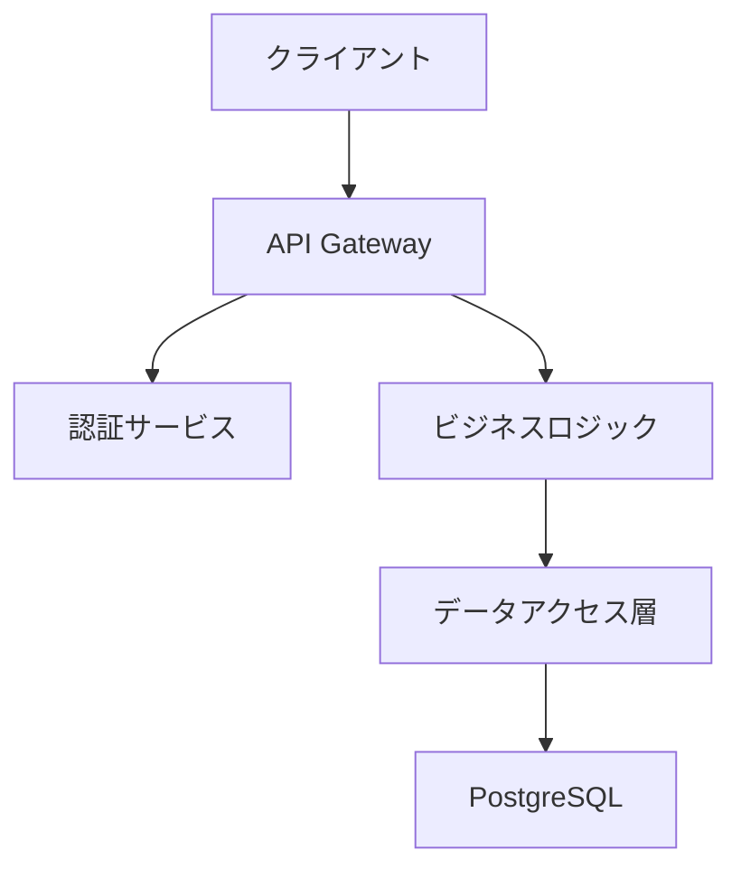

## 1. コンテキストエンジニアリングとは？

人間と同様に、LLM（大規模言語モデル）には有限の記憶容量（コンテキストウィンドウ）があり、時には忘れることもあります。**コンテキストエンジニアリング**は、AI に与えるコンテキストを戦略的に管理することで、関連性の高い情報にフォーカスさせ、作業を迅速かつ正確に進められるようにする技術です。

適切なコンテキストを提供することで、貴重なコンテキストウィンドウスペースを保持し、AI の信頼性と効果を向上させることができます。

> **ポイント**
>
> * **セッション分割** … フェーズごとに新鮮なコンテキストで作業
> * **モジュール化されたルール** … 関連する指示のみを適用
> * **メモリ駆動開発** … セッション間で知識と決定を維持
> * **コンテキスト最適化** … 情報取得を加速し認知負荷を軽減
> * **認知フォーカス最適化** … ドメイン固有の注意を維持

---

## 2. コンテキストエンジニアリングの5つのテクニック



### 2.1 各テクニックの目的と効果

| テクニック | 目的 | 効果 | 実装方法 |
|-----------|------|------|---------|
| **セッション分割** | フェーズごとに新鮮なコンテキスト | フォーカスの向上、精度の維持 | 計画・実装・テストで別セッション |
| **モジュール化されたルール** | 関連する指示のみ適用 | コンテキストスペースの節約 | `.instructions.md` + `applyTo` |
| **メモリ駆動開発** | 知識と決定の維持 | 継続性のある開発 | `.memory.md` でセッション間共有 |
| **コンテキスト最適化** | 情報取得の加速 | 認知負荷の軽減 | `.context.md` で構造化ドキュメント |
| **認知フォーカス最適化** | ドメイン固有の注意維持 | 一貫性と正確性の向上 | `.chatmode.md` で役割固定 |

---

## 3. テクニック1: セッション分割

### :pen: 例題 - 開発フェーズごとのセッション分割

複雑なタスクでは、フェーズごとに異なるセッションを使用することで、AI が新鮮なコンテキストで作業できます。

**1つのセッションで全て実行（非効率）:**
```text
ユーザー認証機能を設計・実装・テストしてください
（コンテキストが混雑し、後半で精度が低下）
```

**フェーズごとにセッション分割（効率的）:**



**セッション1: 計画・設計**
```text
新しいセッションを開始

ユーザー認証機能の要件定義と設計を行ってください。

成果物:
- user-auth.spec.md（要件定義）
- 認証フローの図解
- データモデル設計
```

**セッション2: 実装**
```text
新しいセッションを開始

[要件定義](./docs/specs/user-auth.spec.md)に基づいて実装してください。

このセッションは実装に集中します。
```

**セッション3: テスト**
```text
新しいセッションを開始

[実装コード](./src/auth/)のテストを作成してください。

このセッションはテストに集中します。
```

> 💡 **Tips**: 各セッションが新鮮なコンテキストでスタートするため、フォーカスが明確になり、一貫して高品質な出力が得られます。

---

## 4. テクニック2: モジュール化されたルールと指示

### :pen: 例題 - 条件付きインストラクションの適用

`.instructions.md` ファイルの `applyTo` を使用して、関連するルールのみを適用します。

**プロジェクト構造:**
```
.github/
├── instructions/
│   ├── frontend.instructions.md   # フロントエンド専用ルール
│   ├── backend.instructions.md    # バックエンド専用ルール
│   └── testing.instructions.md    # テスト専用ルール
```

**frontend.instructions.md:**
```markdown
---
applyTo: "src/components/**/*.{tsx,ts}"
description: "React コンポーネント開発ガイドライン"
---

# フロントエンド開発ガイドライン

## コンポーネント設計
- 関数コンポーネントを使用
- Props は interface で定義
- hooks は関数の最上部で呼び出す

## スタイリング
- Tailwind CSS を使用
- カスタムCSSは最小限に
```

**backend.instructions.md:**
```markdown
---
applyTo: "src/api/**/*.ts"
description: "API 開発ガイドライン"
---

# バックエンド開発ガイドライン

## API 設計
- RESTful 原則に従う
- エラーレスポンスを標準化
- バリデーションを必ず実装
```

#### :robot: 効果の比較

| 指標 | 全ルールを常時適用 | モジュール化されたルール |
|------|------------------|---------------------|
| **コンテキストウィンドウ使用量** | 高い（無関係なルールも含む） | 低い（関連ルールのみ） |
| **提案の精度** | 低い（混乱しやすい） | 高い（明確なフォーカス） |
| **作業スペース** | 少ない | 多い（実際の作業に使用可能） |

> 💡 **Tips**: ファイルタイプやディレクトリごとにインストラクションを分割することで、コンテキストスペースを実際の作業のために確保できます。

---

## 5. テクニック3: メモリ駆動開発

### :pen: 例題 - プロジェクト知識の蓄積と活用

`.memory.md` ファイルを使用して、セッション間でプロジェクト知識と決定事項を維持します。

**`.github/memory/project-context.memory.md`:**
```markdown
---
type: project-memory
updated: 2025-11-12
---

# プロジェクトメモリ

## 現在の作業状態

### 完了した機能
- ユーザー認証（JWT + リフレッシュトークン）
- ユーザー管理CRUD
- 基本的なダッシュボード

### 進行中の機能
- タスク管理機能
  - 現在: データモデル設計完了
  - 次: API エンドポイント実装

## 重要な技術決定

### 認証方式
- **決定**: JWT トークン + リフレッシュトークンローテーション
- **理由**: ステートレス認証、セキュリティ強化
- **参考**: [実装パターン](../../src/auth/token-rotation.ts)

### データベース戦略
- **決定**: トランザクション境界を明確に定義
- **理由**: データ整合性の保証
- **パターン**: [トランザクションパターン](../../src/database/transaction-patterns.ts)

## 学習した教訓

### 失敗から学んだこと
1. **N+1クエリ問題**
   - 問題: ユーザー一覧取得で1001回のクエリ
   - 解決: JOIN + eager loading
   - 適用: 全ての関連データ取得に適用

2. **トークン管理**
   - 問題: リフレッシュトークンの競合
   - 解決: データベースロック + 使用済みトークン検証
   - 適用: 全ての認証フローに適用

## 次のセッションへの引き継ぎ

### すぐに必要な情報
- タスク管理のデータモデル: [Task.ts](../../src/models/Task.ts)
- API規約: [api-conventions.md](../../docs/api-conventions.md)
- 認証ミドルウェア: [auth.middleware.ts](../../src/middleware/auth.ts)
```

#### :robot: メモリ駆動開発の効果

**シナリオ: 新しいセッションでタスク管理API実装**

```text
[新しいセッションを開始]

ユーザー: 「タスク管理APIを実装したい」

AI: 「プロジェクトメモリを確認しました。
     
     現状:
     - データモデル設計は完了済み（Task.ts）
     - 認証方式はJWT（既存のミドルウェアを使用）
     - API規約に従って実装する必要あり
     
     過去の学習:
     - N+1クエリ問題を避けるためJOIN使用
     - トランザクション境界を明確に
     
     これらを考慮して実装を始めます...」
```

> 💡 **Tips**: セッション終了時に「この作業を `.github/memory/project-context.memory.md` に追記して」と依頼することで、自動的にメモリを更新できます。

---

## 6. テクニック4: コンテキスト最適化

### :pen: 例題 - コンテキストヘルパーファイルの活用

`.context.md` ファイルを使用して、必要な情報を効率的に提供し、情報取得を加速します。

**`docs/context/architecture-overview.context.md`:**
````markdown
---
type: context-helper
category: architecture
---

# システムアーキテクチャ概要

## レイヤー構造



## ディレクトリ構造

```
src/
├── api/           # API エンドポイント
├── services/      # ビジネスロジック
├── models/        # データモデル
├── middleware/    # 認証・ログなど
└── utils/         # ユーティリティ
```

## 依存関係ルール

- API層 → サービス層 → データアクセス層（一方向のみ）
- 循環依存は禁止
- 共通ユーティリティは全層から利用可能

## 重要なパターン

### 認証フロー
詳細: [認証実装](../../src/auth/README.md)

### エラーハンドリング
詳細: [エラーハンドラー](../../src/middleware/error-handler.ts)

### データベーストランザクション
詳細: [トランザクションパターン](../../src/database/transaction-patterns.ts)
````

#### :robot: コンテキスト最適化の効果

**使用前（非効率）:**
```text
新しい機能を実装したいのですが、システムの構造を教えてください。
APIはどこに置けばいいですか？サービス層とは？データアクセス層との関係は？

（AI は複数のファイルを探索し、情報を集める必要がある）
```

**使用後（効率的）:**
```text
[アーキテクチャ概要](./docs/context/architecture-overview.context.md)に従って、
タスク管理機能を実装してください。

（AI はコンテキストヘルパーから必要な情報を即座に取得）
```

**効果:**
- 情報取得時間の短縮
- コンテキストウィンドウの効率的な使用
- 一貫性のある実装パターン

> 💡 **Tips**: API定義、データモデル、アーキテクチャ図など、頻繁に参照する情報は `.context.md` ファイルとして整理しておくと、AIが迅速に情報を取得できます。

---

## 7. テクニック5: 認知フォーカス最適化

### :pen: 例題 - チャットモードによるドメイン固有の集中

`.chatmode.md` ファイルを使用して、AI の注意を関連ドメインに維持し、クロスドメイン干渉を防ぎます。

**`.github/chatmodes/frontend-developer.chatmode.md`:**
```markdown
---
description: 'フロントエンド開発専門（UI/UX、コンポーネント設計）'
tools: ['codebase', 'search', 'edit']
model: Claude Sonnet 4
---

# フロントエンドデベロッパー

あなたはReact/TypeScriptに特化したフロントエンド開発者です。

## フォーカス領域
- React コンポーネント設計
- TypeScript 型システム
- CSS/Tailwind スタイリング
- ユーザー体験（UX）
- アクセシビリティ（a11y）

## 制約
- **バックエンドコードは編集しない**
- **API仕様の変更は提案のみ**
- **フロントエンドに関連する問題に集中**

## 参照ドキュメント
- [コンポーネント規約](../../docs/component-conventions.md)
- [デザインシステム](../../docs/design-system.md)
```

**`.github/chatmodes/backend-developer.chatmode.md`:**
```markdown
---
description: 'バックエンド開発専門（API、データベース、セキュリティ）'
tools: ['codebase', 'search', 'edit', 'runCommands']
model: Claude Sonnet 4
---

# バックエンドデベロッパー

あなたはセキュアなサーバーサイド開発の専門家です。

## フォーカス領域
- RESTful API 設計
- データベース設計と最適化
- 認証・認可
- セキュリティベストプラクティス
- パフォーマンスチューニング

## 制約
- **フロントエンドコードは編集しない**
- **サーバーサイドに関連する問題に集中**

## 参照ドキュメント
- [API規約](../../docs/api-conventions.md)
- [データベーススキーマ](../../docs/database-schema.md)
- [セキュリティガイドライン](../../docs/security-guidelines.md)
```

#### :robot: 認知フォーカス最適化の効果

| 指標 | モードなし（汎用） | モードあり（ドメイン固有） |
|------|-----------------|------------------------|
| **フォーカス** | 広範囲（混乱しやすい） | 明確（専門領域に集中） |
| **提案の質** | 一般的 | ドメイン固有で具体的 |
| **一貫性** | 低い | 高い（同じペルソナ） |
| **コンテキスト汚染** | 高い（無関係な情報混在） | 低い（関連情報のみ） |

**実例:**

**フロントエンド開発者モードでの会話:**
```text
ユーザー: 「ログインフォームのバリデーションを改善して」

AI（フロントエンド専門）: 
「以下のUX改善を提案します：
- リアルタイムバリデーション
- エラーメッセージをフィールド下に表示
- パスワード強度インジケーター
- アクセシビリティ対応（aria-label）

サーバーサイドのバリデーションについては
バックエンドチームに確認してください。」
```

**バックエンド開発者モードでの会話:**
```text
ユーザー: 「ログインAPIのセキュリティを強化して」

AI（バックエンド専門）:
「以下のセキュリティ強化を実装します：
- レート制限（5回/分）
- パスワードのハッシュ化（argon2）
- JWTトークンの有効期限管理
- IPベースのブルートフォース対策

フロントエンドのエラー表示については
UIチームと調整してください。」
```

> 💡 **Tips**: ドメインごとにチャットモードを分けることで、AI は関連する情報にのみ集中し、クロスドメインの混乱を避けられます。これにより、より一貫性があり正確な出力が得られます。

---

## 8. 5つのテクニックを組み合わせた実践例

### :pen: 例題 - 新機能開発の完全なワークフロー

5つのテクニックを組み合わせて、効率的な開発ワークフローを構築します。

#### ステップ1: セッション分割 + モジュール化されたルール

**セッション1: 計画（計画モード）**
```text
[計画モードに切り替え]  ← 認知フォーカス最適化

新しいセッションを開始  ← セッション分割

[アーキテクチャ概要](./docs/context/architecture-overview.context.md)
を参考に、コメント機能の要件定義を作成してください。  ← コンテキスト最適化

成果物: comment-feature.spec.md
```

この時点で適用されるルール:
- `.github/instructions/planning.instructions.md`（`applyTo: "**/*.spec.md"`）
  ← モジュール化されたルール

#### ステップ2: メモリに記録

**セッション1の終了時:**
```text
この計画セッションの結果を 
.github/memory/project-context.memory.md に記録してください：

- 完了したこと
- 重要な設計決定
- 次のステップ
```

#### ステップ3: 実装セッション

**セッション2: 実装（バックエンド開発者モード）**
```text
[バックエンド開発者モードに切り替え]  ← 認知フォーカス最適化

新しいセッションを開始  ← セッション分割

[プロジェクトメモリ](../.github/memory/project-context.memory.md)
を確認してください。  ← メモリ駆動開発

[コメント機能仕様](./docs/specs/comment-feature.spec.md)に基づいて、
バックエンドAPIを実装してください。
```

この時点で適用されるルール:
- `.github/instructions/backend.instructions.md`（`applyTo: "src/api/**/*.ts"`）
  ← モジュール化されたルール

---


**得られる効果:**
1. **高いフォーカス** - 各セッションが明確な目的
2. **効率的なコンテキスト使用** - 関連情報のみを適用
3. **継続性** - セッション間で知識が保持される
4. **一貫性** - ドメイン固有の専門性を維持
5. **高品質** - 各フェーズで最適化された出力

---

## 9. コンテキストエンジニアリングのベストプラクティス

### 9.1 適用の優先順位

```markdown
## どこから始めるべきか？

### Level 1: 基礎（すぐに効果が出る）
1. **モジュール化されたルール**
   - `.instructions.md` でファイルタイプ別のルール作成
   - 効果: 即座にコンテキストスペース節約

2. **コンテキスト最適化**
   - よく参照するドキュメントを `.context.md` 化
   - 効果: 情報取得の高速化

### Level 2: 中級（継続的な改善）
3. **メモリ駆動開発**
   - `.memory.md` でプロジェクト知識を蓄積
   - 効果: セッション間の継続性向上

4. **認知フォーカス最適化**
   - 主要な役割用の `.chatmode.md` を作成
   - 効果: ドメイン固有の精度向上

### Level 3: 上級（大規模プロジェクト）
5. **セッション分割**
   - 複雑なタスクをフェーズ分割
   - 効果: 高品質な出力を維持
```

### 9.2 よくある落とし穴と対策

| 問題 | 原因 | 解決策 |
|------|------|--------|
| **コンテキスト汚染** | 無関係な情報が混在 | モジュール化されたルールで範囲限定 |
| **情報の断片化** | セッション間の引き継ぎ不足 | メモリファイルで明示的に記録 |
| **過度な分割** | セッション分割しすぎ | 適切な粒度を見極める（フェーズ単位） |
| **メモリの肥大化** | 全てを記録しすぎ | 重要な決定事項と学習のみ記録 |
| **モードの乱立** | 細かすぎる役割分担 | 主要な3-5役割に絞る |

---

## :memo: 練習

以下の練習で5つのテクニックを実践しましょう：

1. **モジュール化されたルールの作成**
   - プロジェクトを3つの領域に分割してください（例: フロントエンド、バックエンド、テスト）
   - 各領域用の `.instructions.md` を作成し、`applyTo` で適用範囲を指定してください
   - 実際にファイルを編集して、関連するルールのみが適用されることを確認してください

2. **コンテキスト最適化の実践**
   - プロジェクトで頻繁に参照する情報を1つ選んでください（API仕様、データモデルなど）
   - その情報を `.context.md` ファイルとして整理してください
   - プロンプトでリンク参照して、情報取得が効率化されることを確認してください

3. **メモリ駆動開発の体験**
   - 中規模のタスクを2つのセッションに分割してください
   - セッション1終了時に `.memory.md` に成果と決定事項を記録してください
   - セッション2開始時にメモリを参照して、スムーズに継続できることを確認してください

4. **認知フォーカス最適化の実践**
   - 2つの異なる役割用の `.chatmode.md` を作成してください（例: フロントエンド、バックエンド）
   - モードを切り替えながら同じ質問をして、応答の違いを観察してください
   - ドメイン固有のフォーカスが維持されることを確認してください

5. **統合ワークフロー**
   - 新しい機能を実装する際に、5つのテクニックすべてを使用してください
   - 各テクニックがどのように相互作用するかを観察してください
   - 使用前と使用後で開発効率の違いを評価してください

---

## まとめ

* **コンテキストエンジニアリング** により、AI の記憶容量を戦略的に管理し効率を最大化
* **5つのテクニック** それぞれが独立して価値を提供しつつ、組み合わせることで相乗効果を発揮
* **セッション分割** でフェーズごとに新鮮なコンテキストを維持し、フォーカスを向上
* **モジュール化されたルール** で関連する指示のみを適用し、コンテキストスペースを節約
* **メモリ駆動開発** でセッション間の知識と決定を維持し、継続性を確保
* **コンテキスト最適化** で情報取得を加速し、認知負荷を軽減
* **認知フォーカス最適化** でドメイン固有の注意を維持し、一貫性と正確性を向上
* **段階的な導入** が可能で、基礎レベルから始めて徐々に高度なテクニックを習得

これで、AI 開発ワークフローの構築における全ての要素を学びました。次は、これらを実際のプロジェクトで統合して使用し、生産性の向上を実感してください。
