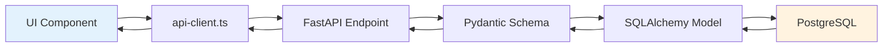

## 1. マルチリポジトリ環境とは？

現代のフルスタック開発では、フロントエンドとバックエンドを別々のリポジトリで管理することが一般的です。GitHub Copilot を活用して、複数のリポジトリを効率的に扱い、整合性を保ちながら開発する方法を学びましょう。

> **ポイント**
>
> * **マルチルートワークスペース** … VS Code で複数リポジトリを同時に開く
> * **クロスリポジトリ参照** … フロントエンドとバックエンドの連携を維持
> * **ワークスペースインデックス** … 大規模プロジェクトでの検索品質向上
> * **統合的なコンテキスト管理** … API仕様とフロントエンド実装の同期

---

## 2. マルチリポジトリ開発の構造

### 2.1 PoC-GitHubCopilotApp2 の構成

本ハンズオンで使用するプロジェクトは、フロントエンドとバックエンドの2つのリポジトリで構成されています：

**PoC-GitHubCopilotApp2-Frontend**
- Next.js + React + TypeScript で構築されたフロントエンドアプリケーション
- チケット管理、ナレッジベース、管理画面などのUIを提供
- バックエンドAPIと連携してデータの表示・操作を行う

**PoC-GitHubCopilotApp2-Backend**
- FastAPI + Python で構築されたRESTful APIサーバー
- データベース（PostgreSQL）との接続とビジネスロジックを担当
- 認証、チケット管理、ナレッジ記事などのエンドポイントを提供

### 2.2 リポジトリ間の依存関係

| 関係性 | 具体例 | 重要性 |
|-------|--------|--------|
| **APIスキーマ** | バックエンドのPydanticモデル ↔ フロントエンドのTypeScript型 | ⭐⭐⭐⭐⭐ |
| **エンドポイント** | FastAPIのルーター ↔ フロントエンドのapi-client.ts | ⭐⭐⭐⭐⭐ |
| **認証フロー** | JWTトークン生成 ↔ トークン検証とストレージ | ⭐⭐⭐⭐⭐ |
| **データ構造** | データベースモデル ↔ UIコンポーネントのプロパティ | ⭐⭐⭐⭐ |

---

## 3. VS Code でマルチルートワークスペースを設定する

### :pen: 例題 - マルチルートワークスペースの作成

PoC-GitHubCopilotApp2 のフロントエンド、バックエンド、仕様書リポジトリを同時に開いて、統合的な開発環境を構築しましょう。

**手順:**

1. **最初のリポジトリを開く**

   ターミナルで以下のコマンドを実行して、フロントエンドリポジトリを VS Code で開きます：

   ```bash
   code [フロントエンドフォルダ名]
   ```

2. **2つ目のリポジトリを追加**

   VS Code のメニューから以下を選択：
   - `ファイル > フォルダーをワークスペースに追加...`
   
   - バックエンドフォルダを選択

   サイドバーに両方のリポジトリが表示されます。

3. **仕様書リポジトリを追加**

   同様の手順で仕様書専用のリポジトリを追加します：
   - `ファイル > フォルダーをワークスペースに追加...`
   - 仕様書フォルダを選択（または新規作成）

   仕様書リポジトリがない場合は、以下のコマンドで作成します：

   ```bash
   # 仕様書専用リポジトリの作成
   mkdir [仕様書フォルダ名]
   cd [仕様書フォルダ名]
   git init
   
   # 仕様書用のディレクトリ構造を作成
   mkdir -p features
   ```

   VS Code で仕様書フォルダを追加すると、サイドバーに3つのリポジトリが表示されます。

4. **ワークスペースを保存**

   VS Code のメニューから以下を選択：
   - `ファイル > 名前を付けてワークスペースを保存...`
   
   - ファイル名を `PoC-GitHubCopilotApp2.code-workspace` として保存

5. **ワークスペースファイルの確認**

   保存したワークスペースファイル（`.code-workspace`）が作成されていることを確認します。

6. **ワークスペースファイルから開く**

   次回以降は、以下のコマンドでワークスペースを直接開けます：

   ```bash
   code [ワークスペース名].code-workspace
   ```

   例: `code PoC-GitHubCopilotApp2.code-workspace`

   3つのリポジトリが同時に読み込まれます。

### :robot: 作成されるワークスペースファイル

```json
{
  "folders": [
    {
      "path": "[フロントエンドフォルダ名]"
    },
    {
      "path": "[バックエンドフォルダ名]"
    },
    {
      "path": "[仕様書フォルダ名]"
    }
  ],
  "settings": {}
}
```

例:
```json
{
  "folders": [
    {
      "path": "helpdesk-frontend"
    },
    {
      "path": "helpdesk-backend"
    },
    {
      "path": "helpdesk-specs"
    }
  ],
  "settings": {}
}
```

サイドバーに3つのプロジェクトが表示され、同時に操作できるようになります。

> 💡 **Tips**: 
> - ワークスペースファイル（`.code-workspace`）をGit管理することで、チーム全体で同じ開発環境を共有できます
> - 仕様書リポジトリを分離することで、非技術者も仕様書の閲覧・編集が容易になります
> - `#codebase` を使うと、3つのリポジトリを横断的に検索できます

---

## 4. ワークスペースインデックスの作成

### 4.1 インデックス作成の重要性

大規模プロジェクトでは、`#codebase` だけでは参照してほしい箇所を見てくれない可能性があります。**ワークスペースインデックス**を事前に作成することで、GitHub Copilot の検索品質を大幅に向上できます。

### 4.2 インデックスタイプの選択

**📊 インデックスタイプ比較表:**

| インデックスタイプ | 対象ファイル数 | 検索品質 | 設定方法 | GitHub連携 | パフォーマンス |
|---|---|---|---|---|---|
| **リモートインデックス** | 制限なし | ⭐⭐⭐⭐⭐ | 手動実行 | 必須 | ⭐⭐⭐⭐⭐ |
| **ローカルインデックス** | 〜2500ファイル | ⭐⭐⭐⭐ | 自動/手動 | 不要 | ⭐⭐⭐⭐ |
| **基本インデックス** | 2500ファイル超 | ⭐⭐ | 自動 | 不要 | ⭐⭐⭐ |

**🔍 各インデックスの特徴:**

- **リモートインデックス**: GitHub Code Search の強力な検索エンジンを活用、最高品質の検索結果
- **ローカルインデックス**: セマンティック検索対応、GitHub なしでも高品質な検索
- **基本インデックス**: テキストベースの基本検索、大規模プロジェクトでも動作保証

---

## 5. クロスリポジトリでの `#codebase` の活用

### 5.1 マルチワークスペースでの `#codebase` の動作

マルチルートワークスペースで複数のリポジトリを開いた状態で `#codebase` を使用すると、GitHub Copilot は**両方のリポジトリを横断的に検索**します。これにより、フロントエンドとバックエンドの実装を同時に参照・理解できます。

**例:**
```text
#codebase チケット機能の実装箇所を教えてください
```

このプロンプトを実行すると、Copilot は以下の両方から情報を取得します：
- **Frontend**: `lib/types.ts`、`app/tickets/page.tsx`、`components/ticket-form.tsx`
- **Backend**: `app/models/ticket.py`、`app/routers/tickets.py`、`app/schemas/ticket.py`

### :pen: 例題 - クロスリポジトリでの機能理解

マルチワークスペースで `#codebase` を使って、フロントエンドとバックエンドの両方からチケット機能の実装を確認しましょう。

**ステップ1: 全体的な構造を理解**

```text
#codebase チケット機能の実装箇所をフロントエンドとバックエンドの両方で教えてください。特にデータモデル、APIエンドポイント、UIコンポーネントの関係性を説明してください
```

### :robot: Copilot の応答例

Copilot が以下のような情報を提供します：

**バックエンド:**
- `app/models/ticket.py` - SQLAlchemy モデル定義
- `app/schemas/ticket.py` - Pydantic スキーマ（リクエスト/レスポンス）
- `app/routers/tickets.py` - API エンドポイント
- `tests/test_tickets.py` - テストコード

**フロントエンド:**
- `lib/types.ts` - TypeScript 型定義
- `lib/api-client.ts` - API クライアント
- `app/tickets/page.tsx` - チケット一覧画面
- `components/ticket-form.tsx` - チケット作成/編集フォーム

**データフロー:**


**ステップ2: 整合性を確認**を確認**

```text
#codebase 認証フローの実装を教えてください。ログイン処理がフロントエンドとバックエンドでどのように連携しているか説明してください
```

### :robot: Copilot の応答例

Copilot は両リポジトリを横断的に検索し、以下の情報を提供します：

**バックエンド（認証処理）:**
- `app/routers/auth.py` - ログインエンドポイント（`POST /auth/login`）
- `app/core/security.py` - JWT トークン生成ロジック
- `app/core/deps.py` - 認証が必要なエンドポイントの依存性

**フロントエンド（認証UI）:**
- `app/login/page.tsx` - ログインページ
- `lib/auth-context.tsx` - 認証状態管理（Context API）
- `lib/api-client.ts` - ログインAPIの呼び出し

**データフロー:**
1. ユーザーがログインフォームに入力
2. フロントエンドが `POST /auth/login` を呼び出し
3. バックエンドがユーザー認証し、JWT トークンを返却
4. フロントエンドが `auth-context.tsx` でトークンを保存
5. 以降のAPI呼び出しで Authorization ヘッダーにトークンを付与

> 💡 **Tips**: `#codebase` を使うことで、マルチワークスペース内の全リポジトリから関連情報を取得し、フロントエンドとバックエンドの連携を包括的に理解できます。

---

## :memo: 練習

以下の練習でマルチリポジトリ開発の理解を深めましょう：

1. **ワークスペースの作成**
   - PoC-GitHubCopilotApp2-Frontend と Backend を含むマルチルートワークスペースを作成してください
   - 両方のリポジトリでリモートインデックスを作成してください
   - `#codebase` を使って、認証フローがどのように実装されているか質問してください

2. **クロスリポジトリ検索**
   - `#codebase` を使って、ナレッジ記事（knowledge articles）機能の実装箇所をフロントエンドとバックエンドの両方で特定してください
   - データモデル、API エンドポイント、UI コンポーネントの対応関係を図示してください

3. **新規フィールドの追加**
   - チケットに「期限（due_date）」フィールドを追加してください
   - バックエンドで Date 型のフィールドを追加し、フロントエンドで DatePicker コンポーネントを実装してください


---

## まとめ

* **マルチルートワークスペース** で複数リポジトリを統合的に管理
* **ワークスペースインデックス** により大規模プロジェクトでも高品質な検索を実現
* **クロスリポジトリ参照** でフロントエンドとバックエンドの整合性を保つ
* **カスタムチャットモード** でリポジトリごとの専門性を分離し、誤った変更を防ぐ
* **`#codebase` の活用** で両リポジトリを横断的に理解・検証

次のセクションでは、プロジェクト固有のルールやベストプラクティスを定義する「カスタムインストラクション」の作成方法を学びます。
