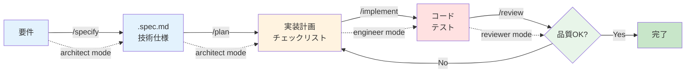

## 1. 仕様駆動開発サイクルとは？

仕様駆動開発（Specification-Driven Development）は、**仕様ファイル（.spec.md）を起点**とした開発プロセスです。4つのエージェントワークフロー（specify / plan / implement / review）を連携させることで、再現可能で高品質な開発サイクルを確立できます。

> **ポイント**
>
> * **仕様ファイル中心** … `[仕様書フォルダ]/[機能名]/` に仕様と設計を蓄積
> * **4フェーズの連携** … specify → plan → implement → review の順次実行
> * **人間の検証ゲート** … 各フェーズで承認を得て、方向性の誤りを防止
> * **成果物の記録** … プロジェクトの知識ベースとして活用
> * **チーム全体での標準化** … 暗黙知を明文化し、品質を均一化

---

## 2. カスタムインストラクション / チャットモード / ワークフローの関係性

実際の開発サイクルを理解する前に、GitHub Copilot の3つの仕組みがどのように連携するかを確認しましょう。

### 2.1 3層アーキテクチャ

この3つの仕組みは、階層的に連携して GitHub Copilot の動作を制御します：

```
┌─────────────────────────────────────────────┐
│  カスタムインストラクション                    │
│  (.github/copilot-instructions.md)          │
│  グローバルルール・プロジェクト固有の制約       │
└─────────────────┬───────────────────────────┘
                  │ プロジェクト全体に適用
                  ↓
┌─────────────────────────────────────────────┐
│  カスタムチャットモード                        │
│  (.github/chatmodes/*.chatmode.md)          │
│  役割分離・ツール境界・専門領域の設定           │
└─────────────────┬───────────────────────────┘
                  │ 特定のモードで実行
                  ↓
┌─────────────────────────────────────────────┐
│  エージェントワークフロー                      │
│  (.github/prompts/*.prompt.md)              │
│  タスク手順・実行指示・成果物フォーマット       │
└─────────────────────────────────────────────┘
```

### 2.2 それぞれの役割

| 仕組み | 適用範囲 | 主な用途 | 具体例 |
|-------|---------|---------|--------|
| **カスタムインストラクション** | プロジェクト全体 | 共通ルール・制約 | 「shadcn/ui を使用」「TypeScript strict モード必須」 |
| **カスタムチャットモード** | 役割ごと | ツール境界・専門領域 | Architect は仕様書のみ編集可能、Engineer は実装 |
| **エージェントワークフロー** | タスクごと | 実行手順・成果物 | 「要件を .spec.md に変換」「5ステップで実装」 |

### 2.3 なぜワークフローが必要か？

チャットモードだけでは、以下の課題があります：

| 課題 | チャットモードのみ | ワークフロー追加後 |
|------|-----------------|-------------------|
| **タスクの標準化** | 毎回異なる指示を手動入力 | テンプレート化された手順を自動実行 |
| **品質の一貫性** | 人によって実行方法が異なる | 同じワークフローで同じ品質を保証 |
| **知識の共有** | 暗黙知に依存 | 明文化されたプロセスとしてチーム共有 |
| **再現性** | 成功体験の再現が困難 | 成功パターンをテンプレート化 |

**実例での理解:**

このセクションでは、4つのワークフロー（specify / plan / implement / review）を実際に使って開発サイクルを体験します。各ワークフローは：

- **カスタムインストラクション**で定義されたプロジェクトルールに従いつつ
- **チャットモード**で設定された役割とツール権限の範囲内で
- **ワークフロー**で定義された手順を実行する

という3層構造で動作します。

---

## 3. 開発サイクルの全体像

### 2.1 4フェーズの流れ



### 3.2 各フェーズの責務と成果物

| フェーズ | チャットモード | 主な責務 | 成果物 |
|---------|--------------|---------|--------|
| **Specify** | `architect` | 要件を構造化し、技術仕様を定義 | `.spec.md`（仕様書） |
| **Plan** | `architect` | 実装計画を作成し、タスクを分解 | `.plan.md`（実装計画） |
| **Implement** | `frontend-engineer`<br/>`backend-engineer` | 実装を実行し、コードを生成 | ソースコード<br/>テストコード |
| **Review** | `fullstack-reviewer` | 成果物をレビューし、品質を検証 | レビューレポート<br/>修正指示 |

---

## 4. 実践演習: チケット検索機能の実装

作成したワークフローを使用して、実際の開発サイクルを体験しましょう。

### 📝 演習の目標

**タスク:** チケット一覧画面からキーワード検索すると該当するタイトルのチケットを取得できる機能を実装する。

**達成基準:**
- ✅ 仕様書（.spec.md）が作成されている
- ✅ フロントエンド・バックエンドそれぞれの実装計画が作成されている
- ✅ コードが実装され、テストが成功している
- ✅ コードレビューが完了し、品質基準を満たしている

---

### フェーズ1: Specify（仕様定義）

#### :pen: 実行コマンド

Copilot Chat で以下を入力してください：

```text
/specify

チケット検索機能を実装したい。チケット一覧画面からキーワード検索すると該当するタイトルのチケットが引っ張ってこれるようにしたい。
```

#### :robot: 期待される出力

**1. Context Loading 開始**

```markdown
仕様定義を開始します。まず、プロジェクトの概要と既存の仕様書を確認します。
```

**2. 仕様書の作成**

````markdown
**2. 仕様書の作成**

```markdown
# チケット検索機能 仕様書

作成日: 2025-01-13

## ユーザーストーリー
**As a** サポート担当者  
**I want to** キーワードでチケットを検索できる  
**So that** 多数のチケットの中から目的のチケットを素早く見つけられる

## 受け入れ条件
- [ ] チケット一覧画面に検索ボックスが表示されている
- [ ] 検索ボックスにキーワードを入力すると、タイトルに該当するチケットが表示される
- [ ] 検索結果が即座に反映される（リアルタイム検索）
- [ ] 検索キーワードがURLパラメータに保持される
- [ ] 検索キーワードがない場合は全てのチケットが表示される

## ユーザーシナリオ
1. **開始**: サポート担当者がチケット一覧画面を開く
2. **アクション**: 検索ボックスに「ログイン」と入力
3. **結果**: タイトルに「ログイン」を含むチケットのみが表示される
4. **完了**: 目的のチケットを見つけて詳細画面へ遷移

## ビジネス価値
- **効率性**: チケット検索時間を70%短縮
- **品質**: 目的のチケットを見逃すリスクがゼロ
- **ユーザー満足度**: ストレスなくチケットを探せる
```
````

**3. 🚨 検証ゲート**

```markdown
🚨 Validation Gate
上記の仕様書ドラフトを確認してください。

承認いただければ、.spec.md ファイルを作成します。修正が必要な場合はお知らせください。
```

#### 💡 ユーザーの操作

仕様書の内容を確認し、問題なければ以下を入力：

```text
承認
```

#### :robot: 承認後の出力

```markdown
✅ 仕様書を作成しました！

作成場所: ticket-search.spec.md
```

---

### フェーズ2: Plan（計画策定）

このフェーズでは、**一回の `/plan` コマンドでフロントエンドとバックエンドの両方の技術設計＆タスク書を作成**します。

#### :pen: 実行コマンド

どちらのリポジトリからでも実行可能（マルチルートワークスペース推奨）：

```text
/plan

#file:[仕様書フォルダ]/ticket-search/ticket-search.spec.md
```

#### :robot: 期待される出力

**1. Context Loading 完了報告**

```markdown
技術設計を開始します。まず、既存のコードベースを確認して類似機能を調査します。
```

**2. 技術設計書の概要提示**

```markdown
## 📋 実装計画の概要

### バックエンド
- エンドポイント: GET /api/tickets に search パラメータ追加
- 検索ロジック: SQLAlchemy LIKE検索
- 変更ファイル数: 3個
- 見積もり: 約45分

### フロントエンド
- UI: SearchBox コンポーネント作成
- 状態管理: URL Search Params 連携
- 変更ファイル数: 4個
- 見積もり: 約60分

### リスク
- 検索パフォーマンス → インデックス追加で対応
- デバウンス処理 → useDebounce hook 使用
```

**3. 🚨 検証ゲート**
```markdown
🚨 Validation Gate
上記の技術設計を確認してください。
承認いただければ、ticket-search.plan.md ファイルを作成します。
```

#### 💡 ユーザーの操作

```text
承認
```

**4. 承認後の自動実行**

```markdown
✅ 技術設計書を作成しました！

作成場所: ticket-search.plan.md

🚀 次のアクション
このプランに基づいて実装を開始できます。推奨される進め方:

Phase 1（バックエンド）:

ticket_service.py に検索ロジック追加
tickets.py にパラメータ追加
テスト作成
Phase 2（フロントエンド）:

lib/hooks/use-debounce.ts 作成
page.tsx に検索UI追加
テスト作成
Phase 3（統合）:

統合テスト
バグ修正
コードレビュー
各フェーズの実装を開始する際は、別のプロンプトまたはコマンドで進めてください。実装支援が必要な場合はお知らせください！

```

---

### フェーズ3: Implementation（実装）

このフェーズでは、フロントエンドとバックエンドそれぞれのリポジトリで適切なエンジニアモードを使用して実装します。


#### :pen: 実行コマンド（バックエンドリポジトリ - backend-engineer モード）

バックエンドリポジトリで `backend-engineer` モードに切り替えて以下を実行：

```text
/implement

#file:../../[仕様書フォルダ]/ticket-search/ticket-search.spec.md
#file:../../[仕様書フォルダ]/ticket-search/ticket-search.plan.md
```

#### :pen: 実行コマンド（フロントエンドリポジトリ - frontend-engineer モード）

フロントエンドリポジトリで `frontend-engineer` モードに切り替えて以下を実行：

```text
/implement

#file:../../[仕様書フォルダ]/ticket-search/ticket-search.spec.md
#file:../../[仕様書フォルダ]/ticket-search/ticket-search.plan.md
```

#### :robot: 期待される動作(フロントエンドを例にする)

**1. Context Loading 完了報告**

```markdown
✅ Context Loading 完了:
- 仕様書読み込み完了
- 技術設計＆タスク書読み込み完了
- コーディング規約確認完了
- 既存パターン確認完了
```

**2. 実装の実行**

AIがフロントエンドとバックエンドそれぞれで以下を実装します：

**フロントエンド:**
- SearchBox コンポーネント作成（shadcn/ui Input使用）
- URL Search Params との連携実装
- API クライアントに検索パラメータ追加
- デバウンス処理の実装
- 単体テスト・E2Eテスト作成

**バックエンド:**
- GET /api/tickets エンドポイントに search パラメータ追加
- チケット検索サービスロジック実装
- SQLAlchemy による LIKE 検索実装
- 検索機能のテスト作成

**3. 実装完了報告**

```markdown
## ✅ 実装完了報告

### 実装ファイル
- [x] `components/search-box.tsx` - SearchBox コンポーネント
- [x] `app/tickets/page.tsx` - SearchBox統合とURL連携
- [x] `lib/api-client.ts` - 検索パラメータ追加
- [x] `app/routers/tickets.py` - search パラメータ対応
- [x] `app/services/ticket_service.py` - 検索ロジック
- [x] `__tests__/*.test.tsx` - テスト作成
- [x] `tests/test_*.py` - テスト作成

### テスト結果
- 成功: 17件 / 失敗: 0件 / カバレッジ: 92%
```

4. バックエンド側も同様に `backend-engineer` モードで `/implement` を実行し、APIエンドポイントの実装とテストを行います。

### フェーズ4: Review（レビュー）

このフェーズでは、フロントエンドとバックエンドの実装を総合的にレビューします。`fullstack-reviewer` モードで実行することで、両方の実装を横断的に確認できます。

#### :pen: 実行コマンド

```text
/review

チケット検索機能の実装をレビューしてください。
フロントエンドとバックエンドの両方の実装を確認してください。
```

#### :robot: 期待される出力

**1. Context Loading 完了報告**

```markdown
Context Loading Phase
まず、必要な情報を収集します。
```

**2. レビュー結果**

````markdown
すべての情報が揃いました。レビュー報告書を作成します。

🔍 チケット検索機能 実装レビュー報告書
📊 レビュー結果サマリー
観点	結果	コメント
仕様整合性	✅ 合格	すべての受け入れ条件を満たしている
コード品質	⚠️ 改善推奨	セキュリティと拡張性に懸念あり
テスト	✅ 合格	Frontend 6/6、Backend 4/4 すべて成功
パフォーマンス	⚠️ 改善推奨	SQLインジェクション対策と最適化が必要
総合判定: ⚠️ 条件付き承認（セキュリティ対策後にマージ推奨）

````

**3. 🚨 最終検証ゲート**

```markdown
🚨 STOP - レビュー結果を確認してください
次のアクションを選択してください:
✅ 承認 → そのままマージ（非推奨 - セキュリティリスクあり）
⚠️ 条件付き承認 → Critical項目修正後にマージ（推奨）
❌ 却下 → 大幅な再実装が必要

```

#### 💡 ユーザーの操作

**オプション1: 改善提案に対応する**

フロントエンドリポジトリで：
```text
/implement

#file:.github/specs/ticket-search/frontend-plan.md

アクセシビリティとローディング表示の改善提案に対応してください。
```

バックエンドリポジトリで：
```text
/implement

#file:../../[仕様書フォルダ]/ticket-search/ticket-search.plan.md

検索キーワードの最小文字数チェックとレスポンス改善に対応してください。
```

**オプション2: そのまま承認**
```text
承認
```

---

## 5. 開発サイクルの継続性確保

長時間の作業や複雑な機能の場合、セッションを分割して進めることが推奨されます。また、実装完了後はコンテキストファイルを更新して、次の開発サイクルで AI が正確な情報を参照できるようにします。

### 5.1 セッション分割の例

**セッション1: Specify + Plan**
```text
/specify
[要件を入力]

↓ 承認

/plan
[計画を作成]

↓ 承認

セッション終了。
次のセッションで /implement を実行してください。
[仕様書フォルダ]/[機能名]/ に仕様と計画が記録されています。
```

**セッション2: Implementation**
```text
新しいセッションを開始

/implement
[仕様書フォルダ]/[機能名]/[機能名].plan.md の計画に従って実装してください。

↓ 実装完了

セッション終了。
次のセッションで /review を実行してください。
```

**セッション3: Review**
```text
新しいセッションを開始

/review
優先度バッジ機能の実装をレビューしてください。

↓ レビュー完了

全フェーズ完了!
```

### 5.2 コンテキストファイルの更新

実装が完了したら、**コンテキストファイルを自動更新**して、次の開発サイクルで AI が正確な情報を参照できるようにします。

#### :pen: 作成するファイル

`.github/prompts/update-context.prompt.md` を作成します

````markdown
---
description: 実装内容をコンテキストファイルに自動反映する
---

# コンテキスト更新ワークフロー

## Steps

### Step 1: Context Loading
以下の情報を収集:

1. **実装計画書の確認**
   - `[仕様書フォルダ]/[機能名]/[機能名].plan.md` を読み込み

2. **変更内容の確認**
   - `#changes` で実装済みの変更を確認

3. **既存コンテキストファイルの読み込み**
   - フロントエンド、バックエンドそれぞれの docs/context フォルダ内のコンテキストファイルを読み込み
   - フロントエンドフォルダ/docs/context/api-overview.context.md
   - フロントエンドフォルダ/docs/context/auth-flow.context.md
   - バックエンドフォルダ/docs/context/api-specification.context.md

### Step 2: Analysis & Identification
実装計画書と変更内容を分析し、更新が必要なコンテキストファイルを特定:

1. **API変更の検出**
   - 新しいエンドポイント、パラメータ、レスポンス形式の追加
   - → `api-specification.context.md` を更新

2. **認証要件の確認**
   - 保護されたルートの追加
   - → `auth-flow.context.md` を更新

3. **データベース変更の検出**
   - テーブル追加、カラム追加、インデックス追加
   - → `database-schema.context.md` を更新

4. **その他の変更**
   - アーキテクチャ変更、新しいパターン導入など

### Step 3: Structured Output
更新内容をレビュー可能な形式で提示:

\```markdown
## 📋 コンテキストファイル更新計画

### 🔍 検出された変更

#### バックエンド変更
- **[エンドポイント名]**: [変更内容]
  - ファイル: `[ファイルパス]`
  - 内容: [詳細]

#### フロントエンド変更
- **[コンポーネント名]**: [変更内容]
  - ファイル: `[ファイルパス]`
  - 機能: [詳細]

---

### 📝 更新対象ファイル

#### 1. api-specification.context.md
**更新箇所:** [セクション名]
**追加内容:**
\```markdown
[具体的な追記内容をマークダウン形式で記載]
\```

#### 2. database-schema.context.md
**更新箇所:** [テーブル名]
**追加内容:**
\```markdown
[具体的な追記内容をマークダウン形式で記載]
\```

#### 3. 更新不要
- ✅ `[ファイル名]`: [理由]
\```

### Step 4: Validation Gate (🚨 STOP)
**ここで必ずユーザーの承認を待つ**

更新計画を提示し、内容を確認してもらう:
- [ ] API仕様の追記内容が正確か
- [ ] データベーススキーマの変更が正確か
- [ ] 不要な更新が含まれていないか
- [ ] 既存の情報と矛盾がないか

- ✅ **承認された場合**: Step 5へ進む
- ❌ **修正が必要な場合**: Step 2に戻る

### Step 5: File Update
承認後、コンテキストファイルを一括更新:

- 各コンテキストファイルに変更内容を追記
- 既存の情報と矛盾がないか確認
- 更新日時を記録

**完了報告:**

\```markdown
✅ コンテキストファイル更新完了

### 📊 更新サマリー
| ファイル | 更新内容 | 状態 |
|---------|---------|------|
| api-specification.context.md | [変更内容] | ✅ 完了 |
| database-schema.context.md | [変更内容] | ✅ 完了 |

### 🚀 次のステップ
これらの更新されたコンテキストファイルは、次の機能開発時に自動的に参照されます。
\```

````

#### :memo: 使い方

ファイル作成後、以下のコマンドで実行：

```text
/update-context

#file:[仕様書フォルダ]/ticket-search/ticket-search.plan.md
```

AI が自動的に：
1. 実装計画書と `#changes` を照合
2. 更新が必要なコンテキストファイルを特定
3. 更新内容を提示して承認を待つ
4. 承認後、コンテキストファイルを一括更新

> 💡 **カスタマイズのポイント**
>
> - **Step 2** でプロジェクト固有のコンテキストファイルを追加
> - **Structured Output** で更新内容の形式を調整
> - **Validation Gate** で確認項目をプロジェクトに合わせて追加


---

## 6. :memo: 練習

### 6.1 練習1: 完全な開発サイクルの実践

**タスク:** タグフィルター機能を、仕様定義からコンテキスト更新まで完全なサイクルで実装してください。

**要件:**
- チケット一覧ページにタグフィルターを追加
- 複数タグの AND/OR 検索
- URL パラメータでフィルター状態を保持

**実行手順（5フェーズ）:**
```text
/specify → /plan → /implement → /review → /update-context
```

具体的には：

```text
/specify
[要件を入力]

/plan
[計画を作成]

/implement
[実装を実行]

/review
[レビューを実施]

/update-context
#file:[仕様書フォルダ]/tag-filter/tag-filter.plan.md
```

> 💡 **Tips**: この5フェーズのサイクル（specify → plan → implement → review → update-context）を習慣化することで、プロジェクトの知識ベースが自然に成長し、AI の提案精度が向上します。

### 6.2 練習2: カスタムワークフローの作成

**タスク:** 自社プロジェクト用にワークフローを改良してください。

**改良ポイント:**
- セキュリティチェックの追加
- パフォーマンステストの追加
- デプロイ前チェックリストの追加
- ロールバック手順の追加

---

## 7. まとめ

* **仕様駆動開発** - `.spec.md` ファイルを起点とした開発プロセス
* **5フェーズサイクル** - specify → plan → implement → review → update-context の順次実行
* **2段階検証ゲート** - 各フェーズで人間の承認を得て、品質を保証
* **Context Loading** - 必要な情報を事前に収集し、AI の判断精度を向上
* **Deterministic Execution** - ステップバイステップの実行で予測可能な動作を実現
* **Structured Output** - 一貫した形式で出力を受け取り、後続処理を効率化
* **自動コンテキスト更新** - `/update-context` で実装内容を自動的にドキュメント化
* **セッション分割** - 長時間作業を複数セッションに分割してコンテキスト制限を回避
* **継続的改善** - コンテキストファイルを常に最新に保ち、AI の判断精度を向上

これで、GitHub Copilot を使った AI 開発ワークフローの完全なサイクルを理解できました。このワークフローをプロジェクトに適用し、継続的に改善していくことで、開発効率と品質を同時に向上させることができます。

次のステップとして、これらのワークフローをチーム全体に展開し、組織の標準プラクティスとして定着させることを検討しましょう。
