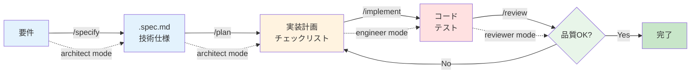

## 1. 仕様駆動開発サイクルとは？

仕様駆動開発（Specification-Driven Development）は、**仕様ファイル（.spec.md）を起点**とした開発プロセスです。4つのエージェントワークフロー（specify / plan / implement / review）を連携させることで、再現可能で高品質な開発サイクルを確立できます。

> **ポイント**
>
> * **仕様ファイル中心** … `.github/specs/` に技術仕様と計画を蓄積
> * **4フェーズの連携** … specify → plan → implement → review の順次実行
> * **人間の検証ゲート** … 各フェーズで承認を得て、方向性の誤りを防止
> * **成果物の記録** … プロジェクトの知識ベースとして活用
> * **チーム全体での標準化** … 暗黙知を明文化し、品質を均一化

---

## 2. カスタムインストラクション / チャットモード / ワークフローの関係性

実際の開発サイクルを理解する前に、GitHub Copilot の3つの仕組みがどのように連携するかを確認しましょう。

### 2.1 3層アーキテクチャ

この3つの仕組みは、階層的に連携して GitHub Copilot の動作を制御します：

```
┌─────────────────────────────────────────────┐
│  カスタムインストラクション                    │
│  (.github/copilot-instructions.md)          │
│  グローバルルール・プロジェクト固有の制約       │
└─────────────────┬───────────────────────────┘
                  │ プロジェクト全体に適用
                  ↓
┌─────────────────────────────────────────────┐
│  カスタムチャットモード                        │
│  (.github/chatmodes/*.chatmode.md)          │
│  役割分離・ツール境界・専門領域の設定           │
└─────────────────┬───────────────────────────┘
                  │ 特定のモードで実行
                  ↓
┌─────────────────────────────────────────────┐
│  エージェントワークフロー                      │
│  (.github/prompts/*.prompt.md)              │
│  タスク手順・実行指示・成果物フォーマット       │
└─────────────────────────────────────────────┘
```

### 2.2 それぞれの役割

| 仕組み | 適用範囲 | 主な用途 | 具体例 |
|-------|---------|---------|--------|
| **カスタムインストラクション** | プロジェクト全体 | 共通ルール・制約 | 「shadcn/ui を使用」「TypeScript strict モード必須」 |
| **カスタムチャットモード** | 役割ごと | ツール境界・専門領域 | Architect は `.github/specs/` のみ編集可能、Engineer は実装 |
| **エージェントワークフロー** | タスクごと | 実行手順・成果物 | 「要件を .spec.md に変換」「5ステップで実装」 |

### 2.3 なぜワークフローが必要か？

チャットモードだけでは、以下の課題があります：

| 課題 | チャットモードのみ | ワークフロー追加後 |
|------|-----------------|-------------------|
| **タスクの標準化** | 毎回異なる指示を手動入力 | テンプレート化された手順を自動実行 |
| **品質の一貫性** | 人によって実行方法が異なる | 同じワークフローで同じ品質を保証 |
| **知識の共有** | 暗黙知に依存 | 明文化されたプロセスとしてチーム共有 |
| **再現性** | 成功体験の再現が困難 | 成功パターンをテンプレート化 |

**実例での理解:**

このセクションでは、4つのワークフロー（specify / plan / implement / review）を実際に使って開発サイクルを体験します。各ワークフローは：

- **カスタムインストラクション**で定義されたプロジェクトルールに従いつつ
- **チャットモード**で設定された役割とツール権限の範囲内で
- **ワークフロー**で定義された手順を実行する

という3層構造で動作します。

---

## 3. 開発サイクルの全体像

### 2.1 4フェーズの流れ



### 3.2 各フェーズの責務と成果物

| フェーズ | チャットモード | 主な責務 | 成果物 |
|---------|--------------|---------|--------|
| **Specify** | `architect` | 要件を構造化し、技術仕様を定義 | `.spec.md`（仕様書） |
| **Plan** | `architect` | 実装計画を作成し、タスクを分解 | `.plan.md`（実装計画） |
| **Implement** | `frontend-engineer`<br/>`backend-engineer` | 実装を実行し、コードを生成 | ソースコード<br/>テストコード |
| **Review** | `fullstack-reviewer` | 成果物をレビューし、品質を検証 | レビューレポート<br/>修正指示 |

---

## 4. 実践演習: チケット検索機能の実装

作成したワークフローを使用して、実際の開発サイクルを体験しましょう。

### 📝 演習の目標

**タスク:** チケット一覧画面からキーワード検索すると該当するタイトルのチケットを取得できる機能を実装する。

**達成基準:**
- ✅ 仕様書（.spec.md）が作成されている
- ✅ フロントエンド・バックエンドそれぞれの実装計画が作成されている
- ✅ コードが実装され、テストが成功している
- ✅ コードレビューが完了し、品質基準を満たしている

---

### フェーズ1: Specify（仕様定義）

#### :pen: 実行コマンド

Copilot Chat で以下を入力してください：

```text
/specify

チケット検索機能を実装したい。チケット一覧画面からキーワード検索すると該当するタイトルのチケットが引っ張ってこれるようにしたい。
```

#### :robot: 期待される出力

**1. Context Loading 完了報告**

```markdown
✅ Context Loading 完了:
- プロジェクト構造確認完了
- 既存の仕様書確認完了（[仕様書フォルダ]/features/）
- API仕様確認完了（検索エンドポイントの確認）
- 既存パターン確認完了（フィルター機能の実装例）
```

**2. 仕様書の作成**

```markdown
# チケット検索機能 仕様書

作成日: 2025-01-13

## 1. 概要

チケット一覧画面にキーワード検索機能を追加し、ユーザーがチケットのタイトルから目的のチケットを素早く見つけられるようにする。

## 2. ユーザーストーリー

### 主要ストーリー

**As a** サポート担当者  
**I want to** キーワードでチケットを検索できる  
**So that** 多数のチケットの中から目的のチケットを素早く見つけられる

## 3. 受け入れ条件

- [ ] チケット一覧画面に検索ボックスが表示されている
- [ ] 検索ボックスにキーワードを入力すると、タイトルに該当するチケットが表示される
- [ ] 検索結果が即座に反映される（リアルタイム検索）
- [ ] 検索キーワードがURLパラメータに保持される（リロード後も検索状態を維持）
- [ ] 検索キーワードがない場合は全てのチケットが表示される

## 4. ユーザーシナリオ

### シナリオ1: キーワード検索

1. **開始**: サポート担当者がチケット一覧画面を開く
2. **アクション**: 検索ボックスに「ログイン」と入力
3. **結果**: タイトルに「ログイン」を含むチケットのみが表示される
4. **完了**: 目的のチケットを見つけて詳細画面へ遷移

## 5. UI/UX 要件

### 表示内容

- 検索ボックス（テキスト入力フィールド）
- 検索アイコン（虫眼鏡マーク）
- 検索結果件数の表示

### 操作方法

- 検索ボックスに文字を入力すると自動的に検索が実行される
- 検索ボックスをクリアすると全件表示に戻る

### 視覚的な要素

- 検索ボックスは一覧の上部に配置
- プレースホルダーテキスト: "チケットを検索..."
- 検索中はローディング表示

## 6. ビジネス価値

| 観点 | 期待される効果 |
|------|--------------|
| **効率性** | チケット検索時間を70%短縮 |
| **品質** | 目的のチケットを見逃すリスクがゼロ |
| **ユーザー満足度** | ストレスなくチケットを探せる |
| **ビジネスインパクト** | 対応スピードの向上による顧客満足度向上 |

## 7. 制約と考慮事項

### 制約

- 検索対象はチケットのタイトルのみ（説明文は含まない）
- 大文字小文字は区別しない

### 考慮事項

- 検索パフォーマンスを考慮してデータベースレベルで検索を実行
- 検索キーワードは最低2文字以上で実行

## 8. 成功指標

- [ ] チケット検索時間が平均30秒から10秒に短縮
- [ ] サポート担当者から「チケットを探しやすくなった」とフィードバック
- [ ] すべての受け入れ条件を満たしている
```

**3. 🚨 検証ゲート**

```markdown
🚨 **STOP - 承認が必要です**

この仕様書の内容を確認してください。

- 内容に問題がなければ **"go"** または **"承認"** と入力してください。
- 修正が必要な場合は、具体的な修正内容を指示してください。

承認後、`[仕様書フォルダ]/features/ticket-search.spec.md` ファイルとして保存します。
```

#### 💡 ユーザーの操作

仕様書の内容を確認し、問題なければ以下を入力：

```text
go
```

#### :robot: 承認後の出力

```markdown
✅ 承認ありがとうございます。仕様書を作成しました。

📄 `[仕様書フォルダ]/features/ticket-search.spec.md` を作成しました。
```

---

### フェーズ2: Plan（計画策定）

このフェーズでは、**一回の `/plan` コマンドでフロントエンドとバックエンドの両方の技術設計＆タスク書を作成**します。

#### :pen: 実行コマンド

どちらのリポジトリからでも実行可能（マルチルートワークスペース推奨）：

```text
/plan

#file:[仕様書フォルダ]/features/ticket-search.spec.md
```

#### :robot: 期待される出力

**1. Context Loading 完了報告**

```markdown
✅ Context Loading 完了:
- 仕様書読み込み完了: ticket-search.spec.md
- フロントエンドディレクトリ構造確認完了
- バックエンドディレクトリ構造確認完了
- API仕様確認完了
- データベーススキーマ確認完了
- 既存実装パターン調査完了
```

**2. 技術設計＆タスク書の概要提示**

```markdown
## 📋 技術設計＆タスク書の概要（ドラフト）

### 🔹 バックエンド技術設計＆タスク書の概要

**実装範囲:**
- API エンドポイント: GET /api/tickets に search パラメータ追加
- サービス層: チケット検索ロジック実装
- 主要な変更ファイル: 4個

**主要な技術選定:**
- SQLAlchemy: LIKE句による部分一致検索
- Pydantic: 検索クエリのバリデーション

**想定タスク数:** 4個
**見積もり所要時間:** 約60分

**主なリスク:**
- 検索パフォーマンス（大量データ時）
- SQLインジェクション対策

---

### 🔹 フロントエンド技術設計＆タスク書の概要

**実装範囲:**
- UI コンポーネント: SearchBox コンポーネント作成
- 状態管理: URL Search Params 連携
- 主要な変更ファイル: 5個

**主要な技術選定:**
- shadcn/ui Input: 検索ボックスUI
- Next.js App Router: URLパラメータ管理

**想定タスク数:** 5個
**見積もり所要時間:** 約75分

**主なリスク:**
- デバウンス処理の実装複雑性
- パフォーマンス（不要なAPI呼び出し）

---

🚨 **STOP - 承認が必要です**

上記の**フロントエンドとバックエンド両方の**技術設計＆タスク書の概要を確認してください。

✅ **内容に問題がなければ**: **"go"** または **"承認"** と入力
❌ **修正が必要な場合**: 具体的な修正内容を指示してください（フロントエンド/バックエンドを明示）
📄 **詳細を確認したい場合**: 「詳細を表示」と入力すると、該当部分の詳細を表示します

承認後、以下のファイルを作成します:
- `[バックエンドのフォルダ]/.github/specs/ticket-search/ticket-search-plan.md`
- `[フロントエンドのフォルダ]/.github/specs/ticket-search/ticket-search-plan.md`
```

**3. 🚨 検証ゲート**

#### 💡 ユーザーの操作

```text
go
```

**4. 承認後の自動実行**

```markdown
✅ ステップ6完了: 技術設計＆タスク書を作成しました
→ バックエンド: [バックエンドのフォルダ]/.github/specs/ticket-search/ticket-search-plan.md
→ フロントエンド: [フロントエンドのフォルダ]/.github/specs/ticket-search/ticket-search-plan.md

✅ 実装計画ワークフローが完了しました

📄 **作成内容:**
- バックエンド技術設計＆タスク書: `[バックエンドのフォルダ]/.github/specs/ticket-search/ticket-search-plan.md`
- フロントエンド技術設計＆タスク書: `[フロントエンドのフォルダ]/.github/specs/ticket-search/ticket-search-plan.md`

**次のステップ:**
- `/implement` で実装を開始
- 実装順序: バックエンド → フロントエンド（または並行開発）

**実装時の参照:**
- 仕様書: `[仕様書フォルダ]/features/ticket-search.spec.md`
- バックエンド技術設計: `[バックエンドのフォルダ]/.github/specs/ticket-search/ticket-search-plan.md`
- フロントエンド技術設計: `[フロントエンドのフォルダ]/.github/specs/ticket-search/ticket-search-plan.md`
```

---

### フェーズ3: Implementation（実装）

このフェーズでは、フロントエンドとバックエンドそれぞれのリポジトリで適切なエンジニアモードを使用して実装します。

#### :pen: 実行コマンド（フロントエンドリポジトリ - frontend-engineer モード）

フロントエンドリポジトリで `frontend-engineer` モードに切り替えて以下を実行：

```text
/implement

#file:../../[仕様書フォルダ]/features/ticket-search.spec.md
#file:.github/specs/ticket-search/frontend-plan.md
```

#### :pen: 実行コマンド（バックエンドリポジトリ - backend-engineer モード）

バックエンドリポジトリで `backend-engineer` モードに切り替えて以下を実行：

```text
/implement

#file:../../[仕様書フォルダ]/features/ticket-search.spec.md
#file:.github/specs/ticket-search/backend-plan.md
```

#### :robot: 期待される動作

**1. Context Loading 完了報告**

```markdown
✅ Context Loading 完了:
- 仕様書読み込み完了
- 技術設計＆タスク書読み込み完了
- コーディング規約確認完了
- 既存パターン確認完了
```

**2. 実装の実行**

AIがフロントエンドとバックエンドそれぞれで以下を実装します：

**フロントエンド:**
- SearchBox コンポーネント作成（shadcn/ui Input使用）
- URL Search Params との連携実装
- API クライアントに検索パラメータ追加
- デバウンス処理の実装
- 単体テスト・E2Eテスト作成

**バックエンド:**
- GET /api/tickets エンドポイントに search パラメータ追加
- チケット検索サービスロジック実装
- SQLAlchemy による LIKE 検索実装
- 検索機能のテスト作成

**3. 実装完了報告**

```markdown
## 実装完了報告

### フロントエンド実装ファイル
- `components/search-box.tsx` - SearchBox コンポーネント作成完了
- `app/tickets/page.tsx` - SearchBox統合、URL パラメータ連携完了
- `lib/api-client.ts` - 検索パラメータ対応完了
- `__tests__/search-box.test.tsx` - 単体テスト作成完了
- `e2e/ticket-search.spec.ts` - E2Eテスト作成完了

### バックエンド実装ファイル
- `app/routers/tickets.py` - search パラメータ追加完了
- `app/services/ticket_service.py` - 検索ロジック実装完了
- `tests/test_tickets.py` - 検索機能テスト作成完了

### テスト結果
✅ フロントエンド: 単体テスト成功（6件）、E2Eテスト成功（3件）、カバレッジ: 91%
✅ バックエンド: 単体テスト成功（8件）、統合テスト成功（4件）、カバレッジ: 93%
````

4. バックエンド側も同様に `backend-engineer` モードで `/implement` を実行し、APIエンドポイントの実装とテストを行います。

### フェーズ4: Review（レビュー）

このフェーズでは、フロントエンドとバックエンドの実装を総合的にレビューします。`fullstack-reviewer` モードで実行することで、両方の実装を横断的に確認できます。

#### :pen: 実行コマンド

```text
/review

チケット検索機能の実装をレビューしてください。
フロントエンドとバックエンドの両方の実装を確認してください。
```

#### :robot: 期待される出力

**1. Context Loading 完了報告**

```markdown
✅ Context Loading 完了:
- フロントエンド変更差分確認完了
- バックエンド変更差分確認完了
- 仕様書確認完了
- テスト結果確認完了（フロントエンド: 9/9成功、バックエンド: 8/8成功）
```

**2. レビュー結果**

````markdown
# コードレビュー結果 - チケット検索機能

## ✅ 良い点

### フロントエンド
- SearchBox コンポーネントが再利用可能な設計
- デバウンス処理で不要なAPI呼び出しを削減
- URL パラメータとの連携が適切
- E2E テストが網羅的

### バックエンド
- SQLインジェクション対策が適切（ORM使用）
- 検索パフォーマンスが良好（LIKE検索）
- エラーハンドリングが適切
- テストカバレッジが高い

### API連携
- フロントエンドとバックエンドのインターフェースが一致
- エラーハンドリングの連携が適切

## ⚠️ 改善提案

### フロントエンド
- [ ] `components/search-box.tsx:25` - 検索ボックスに aria-label 追加を推奨
  ```tsx
  // 現在のコード
  <Input placeholder="チケットを検索..." />
  
  // 修正案
  <Input 
    placeholder="チケットを検索..." 
    aria-label="チケット検索"
  />
  ```

- [ ] `app/tickets/page.tsx:45` - 検索中のローディング表示を追加推奨
  ```tsx
  // 追加すべきコード
  {isSearching && <Spinner />}
  ```

### バックエンド
- [ ] `app/services/ticket_service.py:67` - 検索キーワードの最小文字数チェック追加を推奨
  ```python
  # 追加すべきコード
  if search and len(search) < 2:
      raise ValueError("検索キーワードは2文字以上必要です")
  ```

- [ ] `app/routers/tickets.py:34` - レスポンスに検索結果件数を含めることを推奨

## 🚨 ブロッカー（マージ前に必ず修正）

なし

## 💡 提案（オプション）

- 検索履歴機能の追加
- 検索対象を説明文にも拡大
- 検索結果のハイライト表示

## 総合評価

- セキュリティ: ⭐⭐⭐⭐⭐
- パフォーマンス: ⭐⭐⭐⭐☆
- アクセシビリティ: ⭐⭐⭐⭐☆
- 保守性: ⭐⭐⭐⭐⭐
- テスト: ⭐⭐⭐⭐⭐

**総合**: 条件付き承認（改善提案対応後にマージ推奨）
````

**3. 🚨 最終検証ゲート**

```markdown
🚨 **STOP - 最終確認が必要です**

レビュー結果を確認してください。

### 次のアクション

- **改善提案に対応する場合**: 
  - フロントエンド: `frontend-engineer` モードで `/implement` 実行
  - バックエンド: `backend-engineer` モードで `/implement` 実行
- **対応しない場合**: **"承認"** と入力して完了
- **承認後の作業**: 
  - [ ] フロントエンドをコミット・プッシュ
  - [ ] バックエンドをコミット・プッシュ
  - [ ] それぞれのリポジトリでプルリクエスト作成
  - [ ] CI/CD パイプラインの確認
  - [ ] 統合テスト実施
```

#### 💡 ユーザーの操作

**オプション1: 改善提案に対応する**

フロントエンドリポジトリで：
```text
/implement

#file:.github/specs/ticket-search/frontend-plan.md

アクセシビリティとローディング表示の改善提案に対応してください。
```

バックエンドリポジトリで：
```text
/implement

#file:.github/specs/ticket-search/backend-plan.md

検索キーワードの最小文字数チェックとレスポンス改善に対応してください。
```

**オプション2: そのまま承認**
```text
承認
```
#### 💡 ユーザーの操作

```text
go
```

---

## 5. セッション間の引き継ぎ

長時間の作業や複雑な機能の場合、セッションを分割して進めることが推奨されます。

### 5.1 セッション分割の例

**セッション1: Specify + Plan**
```text
/specify
[要件を入力]

↓ 承認

/plan
[計画を作成]

↓ 承認

セッション終了。
次のセッションで /implement を実行してください。
.github/specs/*.spec.md に仕様と計画が記録されています。
```

**セッション2: Implementation**
```text
新しいセッションを開始

/implement
.github/specs/priority-badge.spec.md の計画に従って実装してください。

↓ 実装完了

セッション終了。
次のセッションで /review を実行してください。
```

**セッション3: Review**
```text
新しいセッションを開始

/review
優先度バッジ機能の実装をレビューしてください。

↓ レビュー完了

全フェーズ完了!
```


---

## 6. :memo: 練習

### 6.1 練習1: 別の機能を追加

**タスク:** タグフィルター機能を同じサイクルで実装してください。

**要件:**
- チケット一覧ページにタグフィルターを追加
- 複数タグの AND/OR 検索
- URL パラメータでフィルター状態を保持

**実行手順:**
```text
/specify
[要件を入力]

/plan
[計画を作成]

/implement
[実装を実行]

/review
[レビューを実施]
```

### 6.2 練習2: カスタムワークフローの作成

**タスク:** 自社プロジェクト用にワークフローを改良してください。

**改良ポイント:**
- セキュリティチェックの追加
- パフォーマンステストの追加
- デプロイ前チェックリストの追加
- ロールバック手順の追加

---

## 7. まとめ

* **仕様駆動開発** - `.spec.md` ファイルを起点とした開発プロセス
* **4フェーズサイクル** - specify → plan → implement → review の順次実行
* **2段階検証ゲート** - 各フェーズで人間の承認を得て、品質を保証
* **Context Loading** - 必要な情報を事前に収集し、AI の判断精度を向上
* **Deterministic Execution** - ステップバイステップの実行で予測可能な動作を実現
* **Structured Output** - 一貫した形式で出力を受け取り、後続処理を効率化
* **セッション分割** - 長時間作業を複数セッションに分割してコンテキスト制限を回避
* **並行開発** - ブランチごとにワークフローを実行し、効率的に機能追加
* **継続的改善** - `.spec.md` に知識を蓄積し、プロジェクトの資産として活用

これで、GitHub Copilot を使った AI 開発ワークフローの完全なサイクルを理解できました。このワークフローをプロジェクトに適用し、継続的に改善していくことで、開発効率と品質を同時に向上させることができます。

次のステップとして、これらのワークフローをチーム全体に展開し、組織の標準プラクティスとして定着させることを検討しましょう。
