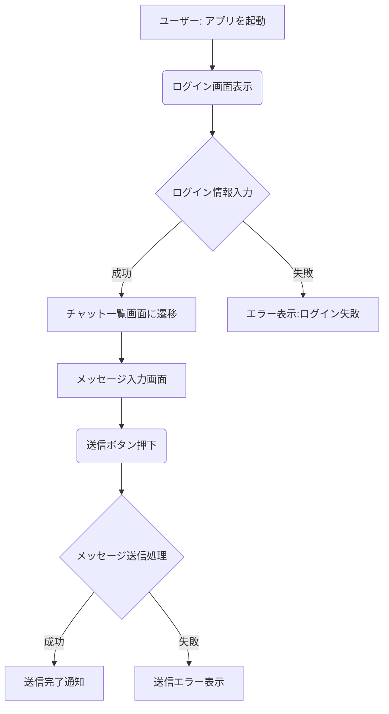
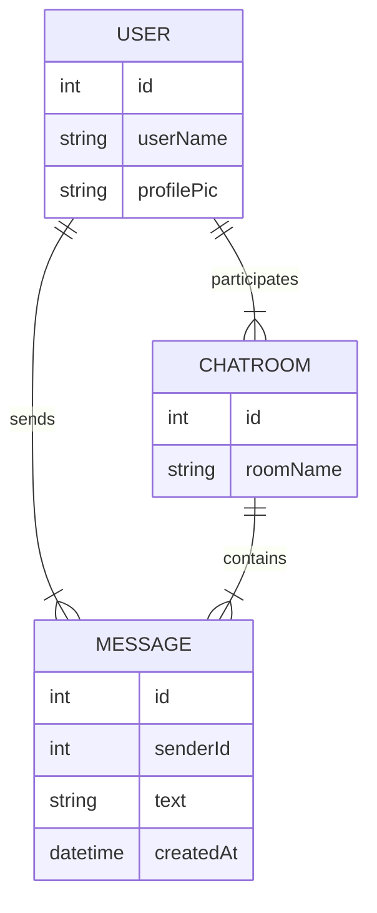

**システムの全体像**や**処理の流れ**を図解するのは、上流工程の重要なタスクです。ここでは、**メッセージングアプリ**の例を使いながら、**Mermaid記法**でフロー図や ER 図を作成する方法を示しつつ、**Copilot** を活用して図のソースコードを自動生成するアイデアを紹介します。

---

## 1. フロー図（業務フロー・処理フロー）

### 1.1 発生するタスク

1. **システムや業務の流れを図解**（アクティビティ図 / フローチャートなど）で表す  
   - 例: 「ユーザーがログインしてからメッセージ送信するまで」のフロー  
2. **各ステップの入出力や例外パターンを洗い出して、設計漏れを防ぐ**  
   - ログイン失敗やメッセージ送信エラーなど例外経路も考慮

### 1.2 GitHub Copilot の活用例

- **ダイアグラムの記法（Mermaid）** を使い、コメントやチャットプロンプトで**「フローチャートを書いて」**と頼むと、Copilot が**雛形のMermaidソース**を提示  
- **メッセージングアプリ**を例にして、**ログイン→チャット一覧表示→メッセージ送信**までの流れを**フローチャート**にしてみる

#### :pen: プロンプト例（チャットビューで Mermaidフローチャートを依頼）

```text
メッセージングアプリで「ユーザーがログイン→メッセージ送信→送信完了」までのフローチャートを Mermaid記法で作ってください。
例外パターン(ログイン失敗)も含めて。
```

#### :robot: 出力例（Mermaidソース一例）

```:text
flowchart TD
    A[ユーザー: アプリを起動] --> B(ログイン画面表示)
    B --> C{ログイン情報入力}
    C -->|成功| D[チャット一覧画面に遷移]
    C -->|失敗| E[エラー表示:ログイン失敗]

    D --> F[メッセージ入力画面]
    F --> G(送信ボタン押下)
    G --> H{メッセージ送信処理}
    H -->|成功| I[送信完了通知]
    H -->|失敗| J[送信エラー表示]
```




> このソースコードをコピーして**Mermaid対応エディタ**や**VS Code**の拡張機能などでプレビューすると**フローチャート図**が得られます。

---

## 2. ユースケースから必要なモデルを考え、ER図に書き起こす

### 2.1 ユースケースからモデルを導く

**ユースケース例**（メッセージングアプリ）  
- ユーザーが自分のプロフィールを作成・更新する  
- 他ユーザーと1対1のメッセージをやり取りする  
- 将来的にグループチャットも検討  

⇒ **エンティティ**として `User`, `Message`, `ChatRoom` などが想定される。

### 2.2 Copilot にER図（Mermaid）を生成させる

#### :pen: プロンプト例

```text
下記のユースケースに基づいてER図をMermaid記法で書いてください。
1) ユーザーがプロフィールを持ち、複数のメッセージを送信
2) グループチャットは将来的に導入
3) 1対1チャットの場合、User同士がMessageで結ばれる
...
```

#### :robot: 出力例（イメージ）



Copilot が**MermaidのER図**を作成し、**User**・**Message**・**ChatRoom** の各エンティティやリレーションを図示してくれます。

---

## 3. まとめ

1. **フロー図**:  
   - システムや業務の流れを可視化 → Copilot に**Mermaid記法の雛形**を書いてもらう → **フローチャート**をプレビュー  
2. **ER図**:  
   - ユースケースで導き出した**エンティティ**(User, Message, ChatRoom等)を**Mermaid** でER図化 → **関係性**を確認  
3. **設計漏れの防止**:  
   - フロー図から**例外経路**を洗い出し、ER図から**テーブル構造**の欠落を見つけやすい  

**Mermaid** 記法で**図を作る**という作業を **Copilot** に部分的に依頼すれば、**初稿生成**の時間が減り、**修正**や**細部詰め**にリソースを回せます。結果的に、**上流工程での設計品質**を高めることができます。