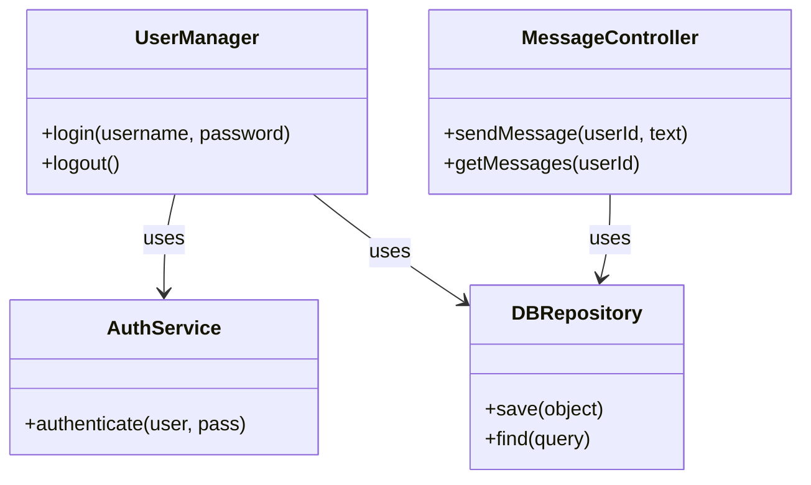
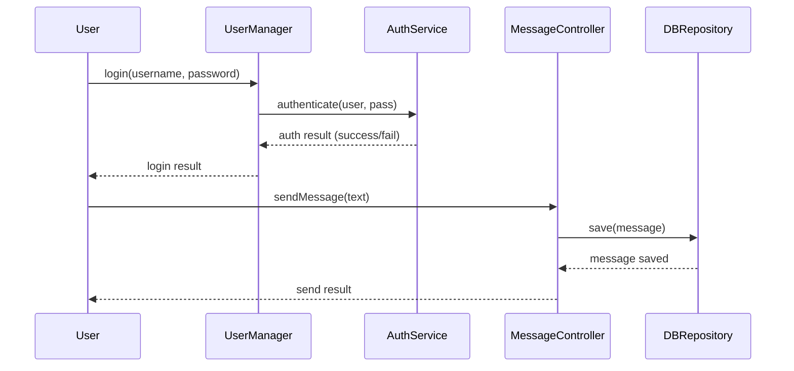

クラス間の関連や継承関係、または処理の流れを可視化する際、**UML 図**が役立ちます。ここでは、**Mermaid** 記法のみを使って **クラス図**や**シーケンス図**を作成する手順や、**Copilot** の活用法を紹介します。

---

## 1. クラス図の作成例

### 1.1 「メッセージングアプリ」でのクラス図

**例**: 主要クラスとして `UserManager`, `AuthService`, `MessageController`, `DBRepository` を想定。

#### :pen: プロンプト例

```text
メッセージングアプリで以下のクラスを使った UMLクラス図を Mermaid記法で作ってください:
- UserManager: login(), logout()
- AuthService: authenticate()
- MessageController: sendMessage(), getMessages()
- DBRepository: save(), find()

UserManagerはAuthServiceとDBRepositoryを利用し、
MessageControllerはDBRepositoryを利用。
継承は特にない。
```

#### :robot: 出力例

```text
classDiagram
    class UserManager {
        +login(username, password)
        +logout()
    }
    class AuthService {
        +authenticate(user, pass)
    }
    class MessageController {
        +sendMessage(userId, text)
        +getMessages(userId)
    }
    class DBRepository {
        +save(object)
        +find(query)
    }

    UserManager --> AuthService : uses
    UserManager --> DBRepository : uses
    MessageController --> DBRepository : uses
```



---

## 3. シーケンス図の作成例

### 3.1 シーケンス図例: 「ユーザーがログインしてメッセージ送信」

#### :pen: プロンプト例

```text
Mermaidのシーケンス図で、ユーザーがログインしてメッセージ送信するフローを書いてください。
登場オブジェクト: User, UserManager, AuthService, MessageController, DBRepository
```

#### :robot: Copilot 出力例（イメージ）



##### 解説
- **sequenceDiagram** ブロック内で**登場オブジェクト**を `participant` として定義  
- **メッセージ送受信**を `->>` で記述 → それぞれの呼び出し矢印が図に描画される  

---

## 4. 練習
 
1. **追加要件を織り込む**  
   - グループチャット、スタンプ送信など → Copilot がどのようにクラス/メッセージを増やすか  
2. **生成後の図を修正**  
   - もしクラス間の関連が間違っていたら、コメントで指摘すると Copilot が修正版を提案

---

## まとめ

- **Mermaid記法** だけで、**クラス図**・**シーケンス図**など各種 UML 図を作成可能  
- **Copilot** に「このクラス群で UML 書いて」と頼めば、**テキストソース**を自動生成  

こうして **Copilot** を活用すれば、**UML 図作成**も効率的に行え、**設計内容**の合意形成が加速します。